## Android 日常笔记(一)
> 这是一篇很早很早的笔记，所以很多内容都显得很蠢，菜鸟一枚

#### 1. adb 连接
    adb connect 192.168.x.x:5555  （设备ip:端口号）
[无线连接 调试](http://blog.csdn.net/earbao/article/details/22575123)  

#### 2. cmd
    执行命令查看是否端口被占用：netstat -ano | findstr "5037" 

#### 3. Environment获取sd卡目录需要添加
    <uses-permission android:name="android.permission.WRITE_EXTERNAL_STORAGE" />
    权限

#### 4. 形参|实参
    int i；
    i就是实参，
    public void get（int y）｛
    ｝
    y就是形参

#### 5. & |（与或）位运算，将值转换成二进制进行比较
    0011010
    1011110
    &0011010
    |1011110
    （|位运算，无论前面的是否成立都会计算后面。||如果前面成立后面便不会运算。）

#### 6. HashMap与ArrayMap的区别
    其实本质上没有区别只是存储读取方式不一样
    如果内存固定ArrayMap能存更多内容
    但是ArrayMap速度更慢

#### 7. [Android 性能分析工具——DDMS](http://www.xuebuyuan.com/1291595.html)


#### 8. as自动初始化控件

    compile 'com.jakewharton:butterknife:7.0.1'

#### 9. 监听EditText内容变化
给EditText追加ChangedListener
```java
    EditText editText = (EditText) findViewById(R.id.edittext);
    
    editText.addTextChangedListener(this);
```

#### 10. viod 类型的方法内return了就表示执行结束

#### 11. foreach遍历循环
遍历for（遍历对象类型：遍历对象）

    int i[20];
    int i;
    for(int y:i)[
    }


#### 12. File路径获取
    getAbsolutePath() 得到绝对路径、全路径。
    getpath 得到缩写的路径，根据当前目录位置可以缩写路径。得到相对路径。
    getCanonicalPath() 得到标准路径，将统一平台间的路径写法差异。
#### 13. String 大小写转换
    toUpperCase的意思是将所有的英文字符转换为大写字母，如：
    String  cc = “aBc123”.toUpperCase();结果就是：ABC123。
    toLowerCase的意思是将所有的英文字符转换为小写字母，如：
    String  cc = “aBc”.toUpperCase();结果就是：abc123。
__备注：这两个方法只对英文字母有效，对除了A~Z和a~z的其余字符无任何效果。__

#### 14. String字符串截取SUB
    String.substring(int i);
~~截取第i位不包括i之后的字符串(从1开始)~~  
截取第i位后面的字符串（从0开始）  
如果用indexOf查找不需要被查找的则需要+查找的字符串长度

    String.substring(int beginIndex, int endIndex)
~~不截取start截取end位。（从1开始）~~  
截取start位 不截取end位（0位开始）

    String sub = "1234";
    System.out.println(sub.substring(sub.indexOf("23")));
    System.out.println(sub.substring(1, 2));
    System.out.println(sub.substring(sub.indexOf("23")+2));
    ----输出-------
    234
    2
    4


#### 15. [Viewholder 的最基本使用Holder（setTag、getTag）](http://www.tuicool.com/articles/vimeAj)
实质就是在View里面可以存放一个数据`tag`。

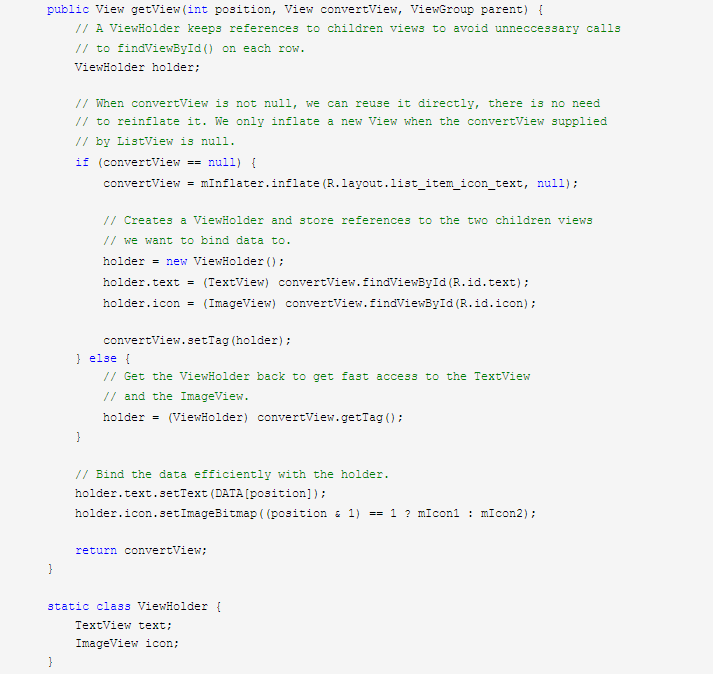


View中的setTag（Onbect）表示给View添加一个格外的数据，以后可以用getTag()将这个数据取出来。


#### 16. super
super出现在继承了父类的子类中。有三种存在方式：  
- 第一种  
`super.xxx;(xxx为变量名或对象名)`  
这种方法意义为，获取父类中的名字为xxx的变量或方法引用。  
使用这种方法可以直接访问父类中的变量或对象，进行修改赋值等操作  
- 第二种  
`super.xxx();(xxx为方法名)`  
这种方法意义为，直接访问并调用父类中的方法。  
- 第三种  
`super();`  
这种方法意义为，调用父类的初始化方法，其实就是调用父类中的public xxx()方法

#### 17. 泛型常用标记
Java泛型中的标记符含义：   
```
     E - Element (在集合中使用，因为集合中存放的是元素)
    
     T - Type（Java 类）
     K - Key（键）
    
     V - Value（值）
     N - Number（数值类型）
    
    ？ -  表示不确定的java类型
     S、U、V  - 2nd、3rd、4th types
```

#### 18. 关于listview的setAdapter和notifyDataSetChanged
其实2个都可以更新，`notifyDataSetChanged`与`setAdapter`执行后都会到getView方法中，不同在于调用`setAdapter`的话`view`是空的需要重新创建，而前者传的是之前的`view`实体；另一个区别`setAdapte`__会使页面回到顶部__，不会停留在之前的位置  
[参考链接](http://blog.csdn.net/zzy7075/article/details/11796311)

#### 19. 强制转换类的时候里面一定要有个无参构造函数否则会获取不到数据
> 表示我看不懂了。。。  
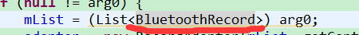  
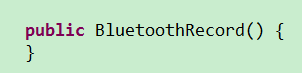  


#### 20. android listview item选中，成选中状态颜色高亮显示方法：
在onitemclick里面设置pos并notifyDataSetChanged，
```java
     public void onItemClick(AdapterView<?> arg0, View arg1, int arg2,long arg3) {  
              
            adapter.setSelectItem(arg2);  
            adapter.notifyDataSetInvalidated();  
    //      adapter.notifyDataSetChanged();  
        } 
```
然后在adapter
```java
     if (position == selectItem) {  
            convertView.setBackgroundColor(Color.RED);  
                }   
        else {  
            convertView.setBackgroundColor(Color.TRANSPARENT);  
                }
```
[参考链接](http://blog.csdn.net/dany1202/article/details/6043654)

#### 21. Adapter notifyDataSetChanged 和notifyDataSetInvalidated区别
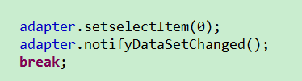  
如果  
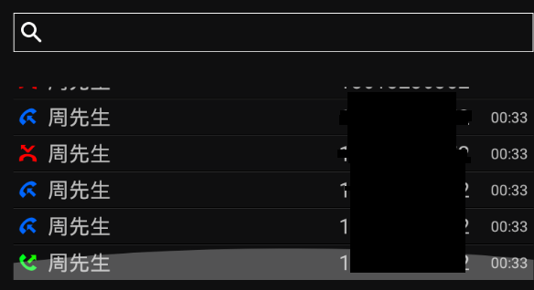

将列表拉倒最底部（item数量超过一页）`notifyDataSetChanged` 不会移除选中效果，但是`notifyDataSetInvalidated`有效
`notifyDataSetInvalidated()`，会重绘控件（还原到初始状态）
`notifyDataSetChanged()`，重绘当前可见区域

#### 22. eplicse经常打印不出log原因：插了手机或者多个设备
> 现在问题不止这个了，可能是你sdk版本太高，建议用Android studio

#### 23. 调试串口修改mac地址
    修改mac地址
```
    su
    busybox ifconfig wlan0 down
    busybox ifconfig wlan0 hw ether 74:51:ba:41:52:82
    busybox ifconfig wlan0 up
    netcfg
```

~~#### 24. win7锁定任务栏图标快捷方式地址~~
~~> 额为什么这个都在这里。~~

~~`C:\Users\Liaohuan\AppData\Roaming\Microsoft\Internet Explorer\Quick Launch\User Pinned\TaskBar`~~


#### 25. android获取屏幕的高度和宽度用到WindowManager这个类，两种方法： 

- 方法一

        WindowManager wm = (WindowManager) getContext()
                        .getSystemService(Context.WINDOW_SERVICE);
         
         int width = wm.getDefaultDisplay().getWidth();
         int height = wm.getDefaultDisplay().getHeight();

- 方法二

        WindowManager wm = this.getWindowManager();
         
         int width = wm.getDefaultDisplay().getWidth();
         int height = wm.getDefaultDisplay().getHeight();
> 额，这特么不一样的嘛。我怎么想的
#### 26. new 和getInstance
> 这。。不是每个类都有getInstance方法的，反正有用这个就不会错了。复用

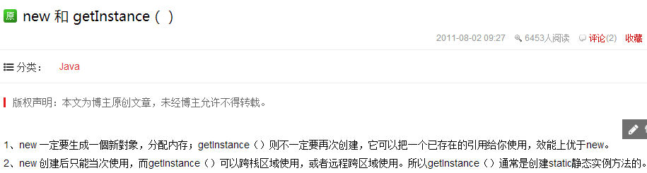


#### 27. 排序：collection

  
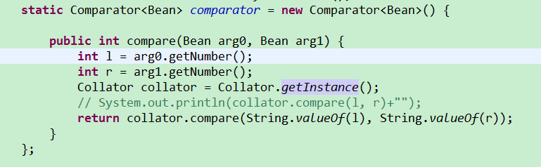

#### 28. 模糊查找（包含）String.contains(String);
> ...

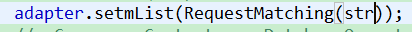    
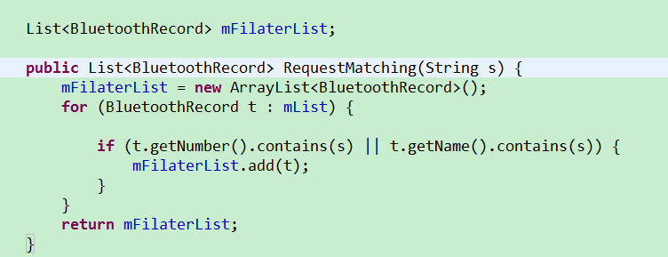

#### 29. 获取assets媒体文件并播放

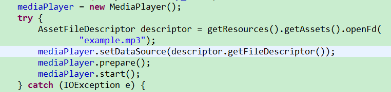

#### 30. [获取屏幕宽度， 高度及Density(显示密度）](http://blog.csdn.net/cnnumen/article/details/7719923)

#### 31.[动画的基本使用方法](http://www.360doc.com/content/13/0102/22/6541311_257754535.shtml)

#### 32. 播放列表，点击列表某一项选择播放
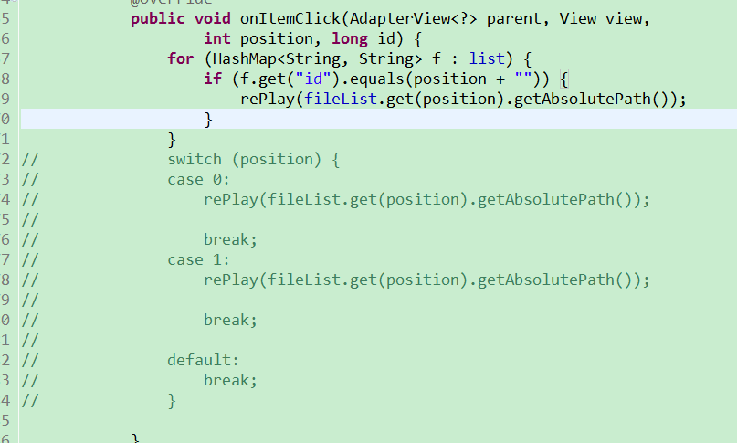

#### 33. focus、click、select、enable
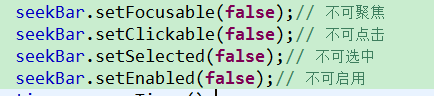


#### 34. onEvent
- onEvent:如果使用onEvent作为订阅函数，那么该事件在哪个线程发布出来的，onEvent就会在这个线程中运行，也就是说发布事件和接收事件线程在同一个线程。使用这个方法时，在onEvent方法中不能执行耗时操作，如果执行耗时操作容易导致事件分发延迟。
- onEventMainThread:如果使用onEventMainThread作为订阅函数，那么不论事件是在哪个线程中发布出来的，onEventMainThread都会在UI线程中执行，接收事件就会在UI线程中运行，这个在Android中是非常有用的，因为在Android中只能在UI线程中跟新UI，所以在onEvnetMainThread方法中是不能执行耗时操作的。
- onEventBackground:如果使用onEventBackgrond作为订阅函数，那么如果事件是在UI线程中发布出来的，那么onEventBackground就会在子线程中运行，如果事件本来就是子线程中发布出来的，那么onEventBackground函数直接在该子线程中执行。
- onEventAsync：使用这个函数作为订阅函数，那么无论事件在哪个线程发布，都会创建新的子线程在执行onEventAsync.

#### 35. switch样式设置
    <style name="widget_gender_switch">
        <item name="android:layout_height">wrap_content</item>
        <item name="android:layout_width">wrap_content</item>
        <item name="android:textOff">""</item><!-- 此设置不需要文字，只显示背景图的开关 -->
        <item name="android:textOn">""</item>
        <item name="android:thumb">@drawable/widget_gender_thumb</item><!--滑块格式9.png -->
        <item name="android:thumbTextPadding">10dp</item><!-- 用来控制背景图片和文字之间的间距来控制switch整体宽度 -->
        <item name="android:track">@drawable/widget_gender_track</item><!-- 背景图的开关 格式9.png-->
    </style>

#### 36. xRecyclerView上拉加载会在底部有块白条，并且加载如果没有延时不会显示动画。
[xRecyclerView](https://github.com/XRecyclerView/XRecyclerView)

#### 37. 禁止屏幕截图
        Window win = getWindow();
    win.addFlags(WindowManager.LayoutParams.FLAG_SECURE);

#### 38. 这是Android原生seekbar.9背景图


#### 39. 数组转化为List对象Arrays.asList()
将一个数组转化为一个List对象，这个方法会返回一个ArrayList类型的对象， 这个ArrayList类并非java.util.ArrayList类，而是Arrays类的静态内部类！
> 获得的list对象无法修改增加，使用`clone()`克隆对象后才可修改

#### 40.从电脑调试安装apk
> adb install + apk

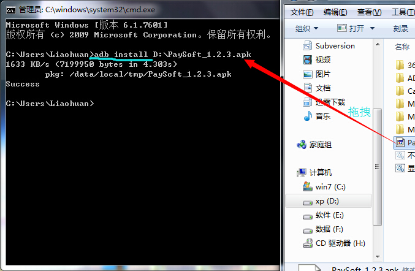

#### 41. 不定参数，其实是个数组
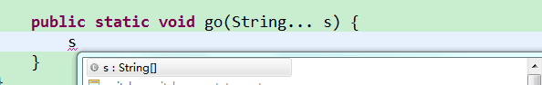

#### 42. 获取网页session
> 打开网页然后地址栏输入js回车

    javascript:alert (document. cookie)

#### 43. XML文件里面context什么意思？
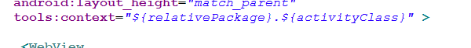  
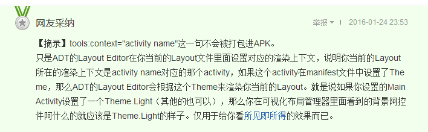


#### 44. 获取焦点 View.requestFocus();
使得控件获取到焦点。
pressed按下后还未松开，表示按下。再松开后当前控件获得了焦点，是focused，同时也有selected状态，表示选中。

但是选中状态的控件是可以有很多个的，而focused的只有一个，即focused和selected的一个重要区别是，一个窗口只能有一个视图获得焦点focused，而一个窗口可以有很多个视图同时处于选中selected状态。

#### 45. String字符串对比String.startsWith();
> 一直用startsWith 都还不晓得还有第二个参数可以添加

    String.startsWith(String str)
    就是检查形参参数是否与你要检查的字符串开头相同,而
    startsWith(Sring str,int Index)
    则是从你要比较的原字符串的指定下标开始和形参作比较，
    这里边呢str.startsWith(String str)和str.startsWith(string str,0)是没有区别的

#### 46. str.lastIndexOf(".");//查找从后往前数的第一个小数点位置。

#### 47. Textview、EditText，XML属性[详解参考：](http://blog.csdn.net/dajian790626/article/details/17798053)
    EditText属性描述
    android:layout_gravity="center_vertical"//设置控件显示的位置：默认top，这里居中显示，还有bottom
    android:hint="请输入数字！"//设置显示在空间上的提示信息
    android:numeric="integer"//设置只能输入整数，如果是小数则是：decimal
    android:maxLength="8"  //限制输入长度为8
    android:singleLine="true"//设置单行输入，一旦设置为true，则文字不会自动换行。
    android:gray="top" //多行中指针在第一行第一位置et.setSelection(et.length());//调整光标到最后一行
    android:autoText //自动拼写帮助
    android:capitalize //首字母大写
    android:digits //设置只接受某些数字
    android:singleLine //是否单行或者多行，回车是离开文本框还是文本框增加新行
    android:numeric //只接受数字
    android:password //密码
    android:phoneNumber // 输入电话号码
    android:editable //是否可编辑
    android:autoLink=”all” //设置文本超链接样式当点击网址时，跳向该网址
    android:password="true"//设置只能输入密码
    android:textColor = "#ff8c00"//字体颜色
    android:textStyle="bold"//字体，bold, italic, bolditalic
    android:textSize="20dip"//大小
    android:capitalize = "characters"//以大写字母写
    android:textAlign="center"//EditText没有这个属性，但TextView有
    android:textColorHighlight="#cccccc"//被选中文字的底色，默认为蓝色
    android:textColorHint="#ffff00"//设置提示信息文字的颜色，默认为灰色
    android:textScaleX="1.5"//控制字与字之间的间距
    android:typeface="monospace"//字型，normal, sans, serif, monospace
    android:background="@null"//空间背景，这里没有，指透明
    android:layout_weight="1"//权重 在控制控   件显示的大小时蛮有用的。
    android:textAppearance="?android:attr/textAppearanceLargeInverse"//文字外观，这里引用的是系统自带的一个外观，？表示系统是否有这种外观，否则使用默认的外观。
    
    TextView属性名称描述
    android:autoLink设置是否当文本为URL链接/email/电话号码/map时，文本显示为可点击的链接。可选值(none/web/email/phone/map/all)
    android:autoText如果设置，将自动执行输入值的拼写纠正。此处无效果，在显示输入法并输入的时候起作用。
    android:bufferType指定getText()方式取得的文本类别。选项editable 类似于StringBuilder可追加字符，也就是说getText后可调用append方法设置文本内容。spannable 则可在给定的字符区域使用样式，参见这里1、这里2。
    android:capitalize设置英文字母大写类型。此处无效果，需要弹出输入法才能看得到，参见EditView此属性说明。
    android:cursorVisible设定光标为显示/隐藏，默认显示。
    android:digits设置允许输入哪些字符。如“1234567890.+-*/% ()”
    android:drawableBottom在text的下方输出一个drawable，如图片。如果指定一个颜色的话会把text的背景设为该颜色，并且同时和background使用时覆盖后者。
    android:drawableLeft在text的左边输出一个drawable，如图片。
    android:drawablePadding设置text与drawable(图片)的间隔，与drawableLeft、drawableRight、drawableTop、drawableBottom一起使用，可设置为负数，单独使用没有效果。
    android:drawableRight在text的右边输出一个drawable，如图片。
    android:drawableTop在text的正上方输出一个drawable，如图片。
    android:editable设置是否可编辑。这里无效果，参见EditView。
    android:editorExtras设置文本的额外的输入数据。在EditView再讨论。
    android:ellipsize设置当文字过长时,该控件该如何显示。有如下值设置：”start”—?省略号显示在开头;”end”——省略号显示在结尾;”middle”—-省略号显示在中间;”marquee” ——以跑马灯的方式显示(动画横向移动)
    android:freezesText设置保存文本的内容以及光标的位置。参见：这里。
    android:gravity设置文本位置，如设置成“center”，文本将居中显示。
    android:hintText为空时显示的文字提示信息，可通过textColorHint设置提示信息的颜色。此属性在EditView中使用，但是这里也可以用。
    android:imeOptions附加功能，设置右下角IME动作与编辑框相关的动作，如actionDone右下角将显示一个“完成”，而不设置默认是一个回车符号。这个在EditView中再详细说明，此处无用。
    android:imeActionId设置IME动作ID。在EditView再做说明，可以先看这篇帖子：这里。
    android:imeActionLabel设置IME动作标签。在EditView再做说明。
    android:includeFontPadding设置文本是否包含顶部和底部额外空白，默认为true。
    android:inputMethod为文本指定输入法，需要完全限定名(完整的包名)。例如：com.google.android.inputmethod.pinyin，但是这里报错找不到。
    android:inputType设置文本的类型，用于帮助输入法显示合适的键盘类型。在EditView中再详细说明，这里无效果。
    android:linksClickable设置链接是否点击连接，即使设置了autoLink。
    android:marqueeRepeatLimit在ellipsize指定marquee的情况下，设置重复滚动的次数，当设置为marquee_forever时表示无限次。
    android:ems设置TextView的宽度为N个字符的宽度。这里测试为一个汉字字符宽度，如图：
    android:maxEms设置TextView的宽度为最长为N个字符的宽度。与ems同时使用时覆盖ems选项。
    android:minEms设置TextView的宽度为最短为N个字符的宽度。与ems同时使用时覆盖ems选项。
    android:maxLength限制显示的文本长度，超出部分不显示。
    android:lines设置文本的行数，设置两行就显示两行，即使第二行没有数据。
    android:maxLines设置文本的最大显示行数，与width或者layout_width结合使用，超出部分自动换行，超出行数将不显示。
    android:minLines设置文本的最小行数，与lines类似。
    android:lineSpacingExtra设置行间距。
    android:lineSpacingMultiplier设置行间距的倍数。如”1.2”
    android:numeric如果被设置，该TextView有一个数字输入法。此处无用，设置后唯一效果是TextView有点击效果，此属性在EdtiView将详细说明。
    android:password以小点”.”显示文本
    android:phoneNumber设置为电话号码的输入方式。
    android:privateImeOptions设置输入法选项，此处无用，在EditText将进一步讨论。
    android:scrollHorizontally设置文本超出TextView的宽度的情况下，是否出现横拉条。
    android:selectAllOnFocus如果文本是可选择的，让他获取焦点而不是将光标移动为文本的开始位置或者末尾位置。TextView中设置后无效果。
    android:shadowColor指定文本阴影的颜色，需要与shadowRadius一起使用。效果：
    android:shadowDx设置阴影横向坐标开始位置。
    android:shadowDy设置阴影纵向坐标开始位置。
    android:shadowRadius设置阴影的半径。设置为0.1就变成字体的颜色了，一般设置为3.0的效果比较好。
    android:singleLine设置单行显示。如果和layout_width一起使用，当文本不能全部显示时，后面用“…”来表示。如android:text="test_ singleLine " android:singleLine="true" android:layout_width="20dp"将只显示“t…”。如果不设置singleLine或者设置为false，文本将自动换行
    android:text设置显示文本.
    android:shadowDx设置阴影横向坐标开始位置。
    android:shadowDy设置阴影纵向坐标开始位置。
    android:shadowRadius设置阴影的半径。设置为0.1就变成字体的颜色了，一般设置为3.0的效果比较好。
    android:singleLine设置单行显示。如果和layout_width一起使用，当文本不能全部显示时，后面用“…”来表示。如android:text="test_ singleLine " android:singleLine="true" android:layout_width="20dp"将只显示“t…”。如果不设置singleLine或者设置为false，文本将自动换行
    android:text设置显示文本.
    android:textSize设置文字大小，推荐度量单位”sp”，如”15sp”
    android:textStyle设置字形[bold(粗体) 0, italic(斜体) 1, bolditalic(又粗又斜) 2] 可以设置一个或多个，用“|”隔开
    android:typeface设置文本字体，必须是以下常量值之一：normal 0, sans 1, serif 2, monospace(等宽字体) 3]
    android:height设置文本区域的高度，支持度量单位：px(像素)/dp/sp/in/mm(毫米)
    android:maxHeight设置文本区域的最大高度
    android:minHeight设置文本区域的最小高度
    android:width设置文本区域的宽度，支持度量单位：px(像素)/dp/sp/in/mm(毫米)，与layout_width的区别看这里。
    android:maxWidth设置文本区域的最大宽度
    android:minWidth设置文本区域的最小宽度
    android:textAppearance设置文字外观。如“?android:attr/textAppearanceLargeInverse”这里引用的是系统自带的一个外观，?表示系统是否有这种外观，否则使用默认的外观。
    可设置的值如下：
    textAppearanceButton/textAppearanceInverse/textAppearanceLarge/textAppearanceLargeInverse/textAppearanceMedium/textAppearanceMediumInverse/textAppearanceSmall/textAppearanceSmallInverse
    android:textAppearance设置文字外观。如“?android:attr/textAppearanceLargeInverse”这里引用的是系统自带的一个外观，?表示系统是否有这种外观，否则使用默认的外观。
    可设置的值如下：
    textAppearanceButton、textAppearanceInverse、textAppearanceLarge、
    textAppearanceLargeInverse、textAppearanceMedium、textAppearanceMediumInverse

#### 48. adb shell input 控制台模拟输入事件信号
- 模拟输入文本信息：input text HelloWorld
- 模拟物理按键操作： input keyevent KEYCODE_VOLUME_DOWN

/KEYCODE_DPAD_RIGHT
按键参考Android键值表：[Android KeyCode 键值列表](https://blog.csdn.net/li631078610/article/details/21092753)
- 模拟点击操作：input tap 500 500
根据分辨率坐标
- 模拟滑动操作：input swipe 200 500  400 500

#### 49. shell neccfg 查看ip地址 
> 不是ifconfig么。。。

#### 50. adb pull和push
    pull 从设备复制到电脑push反之，
    adb shell 进入linux命令模式，ls 查看当前目录，
    cd 进入返回目录，可用TAB快速查看匹配。
    得到路径后exit 退出linux模式。
    adb pull mnt/sdcard/xxx.txt d:/
    将xxx.txt 拷贝到d:/根目录下。
    push一样

#### 51. linux 拷贝命令 
    cp /mnt/sdcard/a.db /mnt/sdcard/b.txt

#### 52. adb启动(打开)app的方法
首先进入shell，$ adb shell

    am start -n ｛包(package)名｝/｛包名｝.{活动(activity)名称}
    eg:# am start -n com.android.calendar/com.android.calendar.LaunchActivity

#### 53. linux root 权限删除系统文件
> 8.0挂载方式为mount -o rw,remount /system

    su
    mount -o remount /system
    cd system/pri-app/
    rm -rf Launcher3
    sync
    reboot
