## Android 日常笔记(三)

#### 1.& |位运算优先级

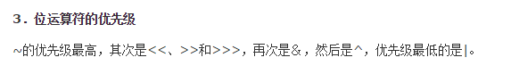

---

#### 2. 在ScrollView/NestedScrollView里面当滚动条不满足全屏需要在屏幕底部添加控件时，会往上移动。

[参考：](https://blog.csdn.net/hellokittylin/article/details/47321753)
添加`android:fillViewport="true"`可以使得里面的ListView等可扩展控件铺满全屏，当超过屏幕时候没有作用。
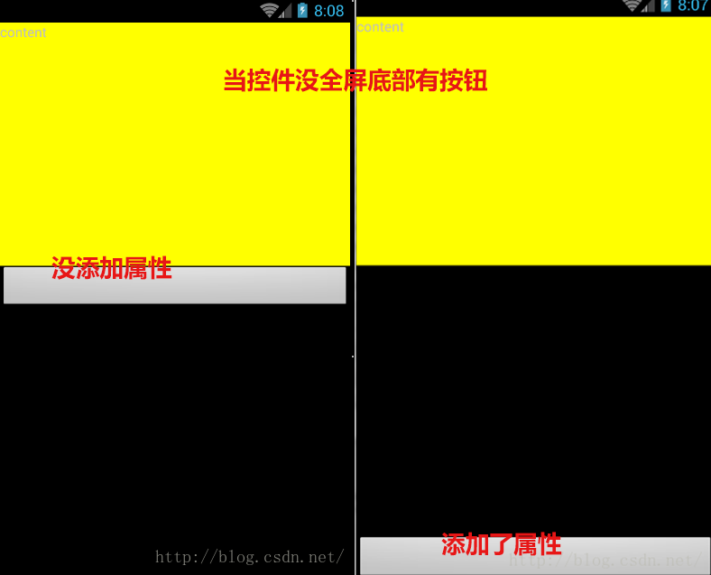

---

#### 3. Android tips（八）-->AS打包apk，aar，jar包：位置：module/build/intermediates/bundles/release/classes.jar

​             <http://www.w2bc.com/article/161084>

---
#### 4. XML中 “？”引用主题属性，当您使用这个标记，你所提供的资源名必须能够在主题属性中找到，因为资源工具认为这个资源属性是被期望得到的，您不需要明确的指出它的类型
>（?android:attr/android:textDisabledColor）。

---
#### 5. Activity设置全屏
```java
//设置无标题  
​     requestWindowFeature(Window.FEATURE_NO_TITLE);  
//设置全屏  
 getWindow().setFlags(WindowManager.LayoutParams.FLAG_FULLSCREEN,WindowManager.LayoutParams.FLAG_FULLSCREEN);  
```
```xml
<!-- 隐藏状态栏 -->  
<item name="android:windowFullscreen">true</item>   
<!-- 隐藏标题栏 -->    
<item name="android:windowNoTitle">true</item>
```

---
#### 6.  [**Android Studio常见错误之：Rendering Problems/The following classes could not be instantiated**](http://blog.csdn.net/u012719153/article/details/46040711)  
AS预览资源文件显示不出来
<http://blog.csdn.net/u012719153/article/details/46040711>

解决办法：
```xml
打开res/values/目录下styles.xml文件。
把：<style name="AppTheme" parent="Theme.AppCompat.Light.DarkActionBar">
修改为： <style name="AppTheme" parent="Base.Theme.AppCompat.Light.DarkActionBar">
```

---
#### 7. 数据流写后同步操作

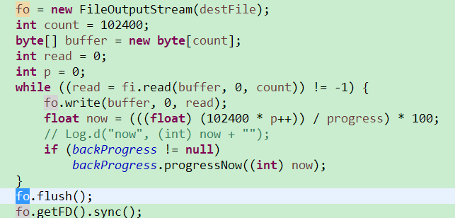

fo.flush();

fo.getFD().sync();

可以让拷贝完毕文件后迅速将缓存写入设备。这样即使马上拔除设备也不会导致copy失败。

---
#### 8.  如果你的textview宽度大于了maxEms的值

那么maxEms会为textview的最大宽度
<http://blog.csdn.net/beiminglei/article/details/9317997>

---
#### 9.act被打开后，如果再次startActivity启动这个activity
> 注：此act启动模式必须是single 否则就会打开新的act
```java
	@Override
    protected void onNewIntent(Intent intent)  
```
<http://gundumw100.iteye.com/blog/2160467>

当一个act被打开后，如果再次点击startActivity启动这个activity就会调用这个方法。可以用于当前act在后台，然后再次startActivity的时候有参数传入的时候用。

比如图片浏览器如果你打开了一张图片，然后放在后台，你从文件管理器再调用图片浏览器打开一张图片，如果直接传参startActivity的话会显示之前打开的图片，这时候就可以在onNewIntent里面接收参数处理。注：次act启动模式必须是single

---
#### 10. 在java代码中添加多个setGravity可以直接用|间隔setGravity(Gravity.CENTER_VERTICAL|Gravity.END);

对比xml：android:gravity="center_vertical|right"

---
#### 11.  桌面小控件可以不再广播中更新，再server或者activity中也可以。
> 这个具体看如何写一个桌面小控件
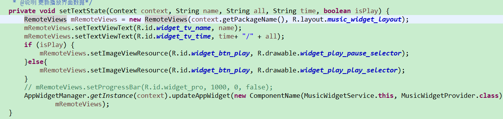

---
#### 12.   Android 5.1隐式启动Server需要添加包名，启动哪个server就加哪个apk的包名。

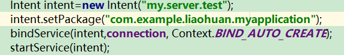

参考：[**关于Android Service真正的完全详解，你需要知道的一切**](http://blog.csdn.net/javazejian/article/details/52709857)

---
#### 13. ec查找文件内容用ctrl+H,查找文件名用shift+ctrl+R

<http://blog.csdn.net/yongh701/article/details/45716079>

---
#### 14.  listview item 中有button 之类控件导致item不能获取到焦点问题，只需要在button中添加
```xml
android:focusable="false“
```

---
#### 15.  TextView setTextColor的相关问题。

在java代码中如果要设置点击效果颜色不能直接R.drawable.xxxx这样会使用16进制的颜色。
正确使用方法
```java
setTextColor(getResources().getColorStateList(R.drawable.lexus_set_text_selecrtor));
```
参考：<http://blog.csdn.net/u012532559/article/details/44925285>

---
#### 16. java代码中为 RelativeLayout布局中的控件设置BELOW、ALIGN_PARENT_BOTTOM等属性方法：
```java
LayoutParams lp = (LayoutParams) gridView.getLayoutParams();
​        lp.addRule(RelativeLayout.BELOW,0);//第二个参数传入view的id，即可在其下方
​        LayoutParams lpTop =  (LayoutParams) re_top.getLayoutParams();
​        lpTop.addRule(RelativeLayout.ALIGN_PARENT_BOTTOM);
```

---
#### 17.  获取Android系统时间是24小时制还是12小时制
```java
android.text.format.DateFormat.is24HourFormat(context)
```

---
#### 18.  最近想提取一个Theme.Material里面的checkBox的一个样式文件，费了不少功夫终于还是提取出来了。

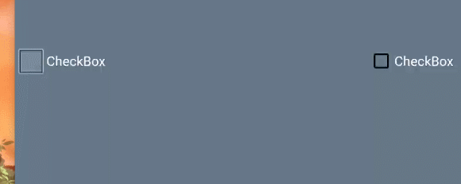

- 首先我从themes_material-->Theme.Material里面去搜索checkboxStyle，根据指示进到`@style/Widget.Material.CompoundButton.CheckBox`发现里面只有一个
```xml
<item name="background">@drawable/control_background_40dp_material</item>
```
背景属性，也就是说控制checkBox效果的button属性没在这里。再进这个父类Widget.CompoundButton.CheckBox

果然button属性在这里。
```xml
<item name="button">?attr/listChoiceIndicatorMultiple</item>
```
可是这个属性是和Theme通用的，也就是说默认的也使用的这个，那那个效果在哪里呢？

而且?attr/这个属性是引用style里面的属性的意思（百度查到）

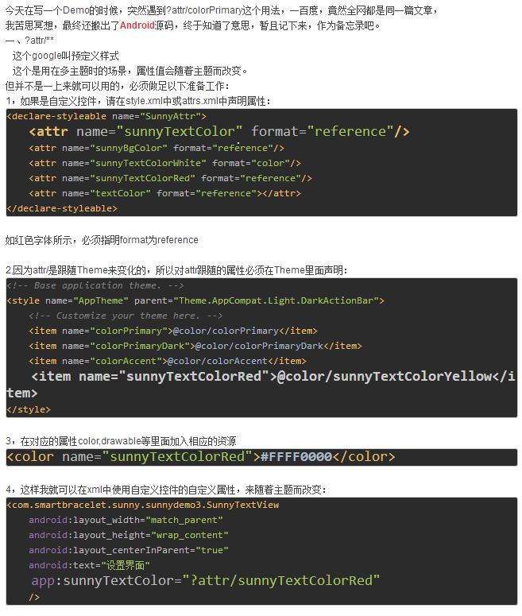

顿时我就懵逼了，listChoiceIndicatorMultiple这个是什么属性啊我去哪找。。

然后在checkBox的源码分析（<http://blog.csdn.net/hp910315/article/details/47834817>）里面得知这个属性在Theme里面。去一搜果然。
```xml
<item name="listChoiceIndicatorMultiple">@drawable/btn_check_material_anim</item>
```
Google也是的干嘛绕这么大个圈子。。。直接在Theme.Material里面加个button属性不行么。。终于还是找到了，然后去\SDK\platforms\android-23\data\res里面找到对应的资源。不知道为什么有些资源不能在@android：里面找到。那就复制出来把。Material的居然还是用svg画的。。（<https://www.cnblogs.com/yuhanghzsd/p/5466846.html>）

全部复制出来后运行居然报错，最后多次摸索发现是
```xml
android:tint="@color/control_checkable_material"
```
这句有问题。删掉就好了。也不知道干嘛的。还有
```xml
<transition

​        android:fromId="@+id/unchecked"

​        android:toId="@+id/checked"

​        android:drawable="@drawable/ic_checkbox_unchecked_to_checked_animation" />

​    <transition

​        android:fromId="@+id/checked"

​        android:toId="@+id/unchecked"

​        android:drawable="@drawable/ic_checkbox_checked_to_unchecked_animation" />
```
这两个应该是点击动画效果，，不过很短，肉眼很难察觉（一个短于0.1s的动画要多加7.8个文件），我觉得麻烦删掉了。

一切搞定之后发现点击的时候没有点击效果

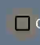

就是这个按下效果没有。。btn_check_material_anim里面也没有，在Theme里面的checkbox Style是有的。可这里没有。。突然记起来前面有个

<item name="background">@drawable/control_background_40dp_material</item>

属性，进去一看果然在这里面。

---
#### 19. android  5.0各颜色属性设置

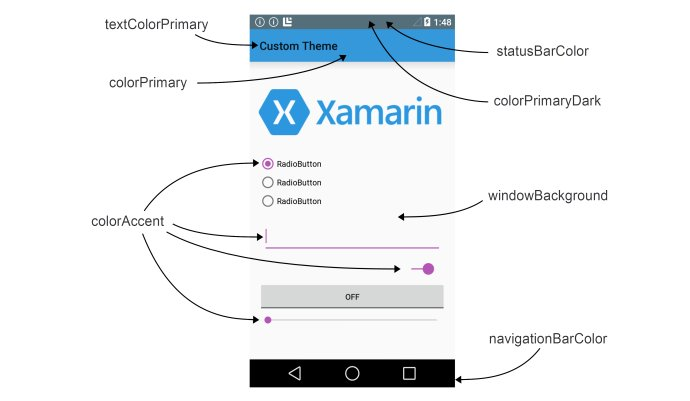

- colorPrimary 应用的主要色调，actionBar默认使用该颜色，Toolbar导航栏的底色

- colorPrimaryDark 应用的主要暗色调，statusBarColor默认使用该颜色

- statusBarColor 状态栏颜色，默认使用colorPrimaryDark

- windowBackground 窗口背景颜色

- .navigationBarColor 底部栏颜色

- colorForeground 应用的前景色，ListView的分割线，switch滑动区默认使用该颜色

- colorBackground 应用的背景色，popMenu的背景默认使用该颜色

- colorAccent CheckBox，RadioButton，SwitchCompat等一般控件的选中效果默认采用该颜色

- colorControlNormal CheckBox，RadioButton，SwitchCompat等默认状态的颜色。

- colorControlHighlight 控件按压时的色调

- colorControlActivated 控件选中时的颜色，默认使用colorAccent

- colorButtonNormal 默认按钮的背景颜色

- editTextColor：默认EditView输入框字体的颜色。

- textColor Button，textView的文字颜色

- textColorPrimaryDisableOnly RadioButton checkbox等控件的文字

- textColorPrimary 应用的主要文字颜色，actionBar的标题文字默认使用该颜色

- colorSwitchThumbNormal: switch thumbs 默认状态的颜色. (switch off)

---
#### 20. 在最近任务列表隐藏activity
```xml
android:excludeFromRecents="true" 
```
在activity中添加这个属性可以在任务列表中隐藏当前activity。（被杀了？）

<http://blog.csdn.net/yayun0516/article/details/52108210>

---
#### 21.  android 音量相关

AudioManager类位于android.Media 包中，通过getSystemService(Context.AUDIO_SERVICE)方法获得AudioManager实例对象。
```java
AudioManager audiomanage = (AudioManager)context.getSystemService(Context.AUDIO_SERVICE);
```
audiomanager就是我们定义的控制系统声音的对象。

常用的音量控制的方法如下：

- 获取系统的最大音量

	getStreamMaxVolume（int streamType）

- 获取当前手机音量

	getStreamVolume(int streamType) --- --- 返回int类型的结果，最大值为7最小值为0，为0时默认开启振动模式。

- 逐级性增大或减小音量（该方法不能直接设置音量为某个值，而是从当前音量逐级递减或递加，一般结合Button使用）

	adjustStreamVolume(int  streamType,int  direction,int flags);
	
	第二个参数为调整音量的方向，取值有：ADJUST_LOWER(降低声音), ADJUST_RAISE（增加声音）和ADJUST_SAME。

- 直接性设置音量大小（该方法适用于直接设置当前音量为某个值----一般结合SeekBar使用）

	setStreamVolume(int streamType, int index, int flags)
	
	第一个参数的几个值：
```java
   AudioManager.STREAM_ALARM：手机闹铃的声音

   AudioManager.STREAM_MUSIC：手机音乐的声音

   AudioManager.STREAM_DTMF：DTMF音调的声音

   AudioManager. STREAM_RING：电话铃声的声音

   AudioManager. STREAM_NOTFICATION：系统提示的声音

   AudioManager.STREAM_SYSTEM：系统的声音

   AudioManager. STREAM_VOICE_CALL：语音电话声音
```
	第二个表示调整音乐的大小，
	第三个参数表示显示调整时的可选的标志位，常取值为AudioManager.FLAG_SHOW_UI；


- 设置指定类型的声音是否为静音，true代表为静音，false取消静音

	setStreamMute(int  streamType,Boolean state):
	
	如为播放音乐设置点击静音按钮时静音，则如下：
	
	setStreamMute(AudioManager.STREAM_MUSIC, true)；

常用方法：
```java
android audioManager获取音量：

先获取AudioManager实例，

AudioManager mAudioManager = (AudioManager)getSystemService(Context.AUDIO_SERVICE);

//通话音量

int max =mAudioManager.getStreamMaxVolume( AudioManager.STREAM_VOICE_CALL ); 

int current =mAudioManager.getStreamVolume( AudioManager.STREAM_VOICE_CALL ); 

//系统音量

int max =mAudioManager.getStreamMaxVolume( AudioManager.STREAM_SYSTEM ); 

current =mAudioManager.getStreamVolume( AudioManager.STREAM_SYSTEM ); 

//铃声音量

max =mAudioManager.getStreamMaxVolume( AudioManager.STREAM_RING ); 

current =mAudioManager.getStreamVolume( AudioManager.STREAM_RING ); 

//音乐音量

max =mAudioManager.getStreamMaxVolume( AudioManager.STREAM_MUSIC ); 

current =mAudioManager.getStreamVolume( AudioManager.STREAM_MUSIC ); 

 

//提示声音音量

max =mAudioManager.getStreamMaxVolume( AudioManager.STREAM_ALARM ); 

current =mAudioManager.getStreamVolume( AudioManager.STREAM_ALARM ); 
```

---
#### 22.  蓝牙：

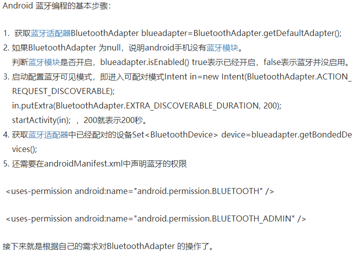


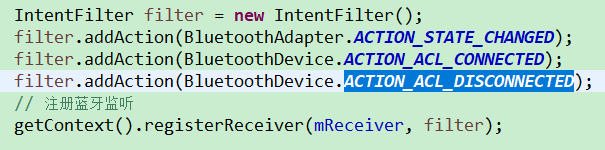


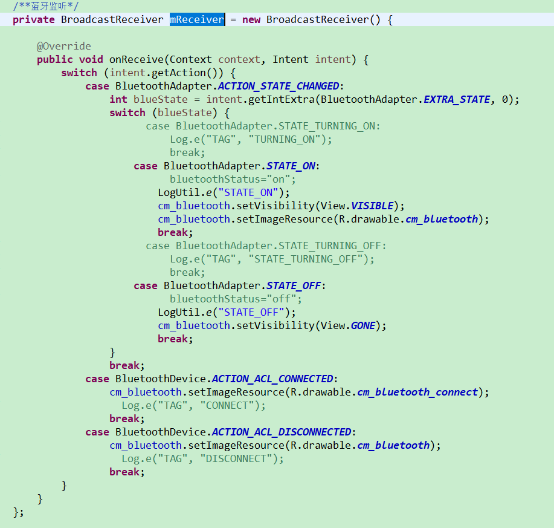

---
#### 23.  android  获取api版本号
```java
Build.VERSION.SDK_INT
```
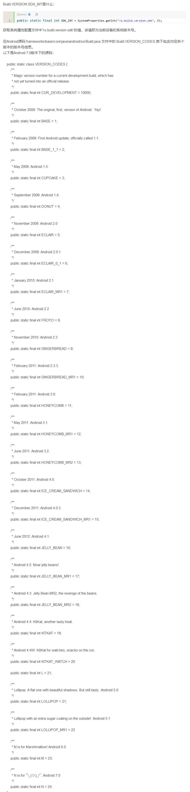

---
#### 24. MD主题切换 

**Material Design的Theme**

md的主题有：

@android:style/Theme.Material

@android:style/Theme.Material.Light

@android:style/Theme.MaterialLight.DarkActionBar

与之对应的Compat Theme：

Theme.AppCompat

Theme.AppCompat.Light

Theme.AppCompat.Light.DarkActionBar

<https://www.jianshu.com/p/3a56180d41fb>

---
#### 25.  Android startActivityForResult用法详解<http://www.cnblogs.com/zgqys1980/p/5286208.html>
```java
//得到新打开Activity关闭后返回的数据

//第二个参数为请求码，可以根据业务需求自己编号

​    startActivityForResult(new Intent(MainActivity.this, OtherActivity.class), 1);
```
第二个Activity
```java

//数据是使用Intent返回
   Intent intent = new Intent();
//把返回数据存入Intent
 intent.putExtra("result", "My name is linjiqin");

​    //设置返回数据
 	 OtherActivity.this.setResult(RESULT_OK, intent);
​    //关闭Activity

 OtherActivity.this.finish();
```

PS.**请求码的作用**                

使用startActivityForResult(Intent intent, int requestCode)方法打开新的Activity，我们需要为startActivityForResult()方法传入一个请求码(第二个参数)。请求码的值是根据业务需要由自已设定，用于标识请求来源。例如：一个Activity有两个按钮，点击这两个按钮都会打开同一个Activity，不管是那个按钮打开新Activity，当这个新Activity关闭后，系统都会调用前面Activity的onActivityResult(int requestCode, int resultCode, Intent data)方法。在onActivityResult()方法如果需要知道新Activity是由那个按钮打开的，并且要做出相应的业务处理，这时可以这样做：
```java
 @Override  public void onCreate(Bundle savedInstanceState) {

​        ....
​        button1.setOnClickListener(new View.OnClickListener(){
​            public void onClick(View v) {
​                startActivityForResult (new Intent(MainActivity.this, NewActivity.class), 1);
​           }
​        });

​        button2.setOnClickListener(new View.OnClickListener(){
​            public void onClick(View v) {
​                 startActivityForResult (new Intent(MainActivity.this, NewActivity.class), 2);
​            }
​        });
​                          

​       @Override protected void onActivityResult(int requestCode, int resultCode, Intent data) {
​               switch(requestCode){
​                   case 1:
​                   //来自按钮1的请求，作相应业务处理
​                   case 2:
​                   //来自按钮2的请求，作相应业务处理
​                }
​          }
}
```


**结果码的作用**

在一个Activity中，可能会使用startActivityForResult()方法打开多个不同的Activity处理不同的业务，当这些新Activity关闭后，系统都会调用前面Activity的onActivityResult(int requestCode, int resultCode, Intent data)方法。为了知道返回的数据来自于哪个新Activity，在onActivityResult()方法中可以这样做(ResultActivity和NewActivity为要打开的新Activity)：
```java
public class ResultActivity extends Activity {
​       .....
​       ResultActivity.this.setResult(1, intent);

​       ResultActivity.this.finish();
}

public class NewActivity extends Activity {
​       ......
​        NewActivity.this.setResult(2, intent);
​        NewActivity.this.finish();
}

public class MainActivity extends Activity { // 在该Activity会打开ResultActivity和NewActivity

​       @Override protected void onActivityResult(int requestCode, int resultCode, Intent data) {

​               switch(resultCode){
​                   case 1:
​                   // ResultActivity的返回数据
​                   case 2:
​                    // NewActivity的返回数据
​                }
​          }
} 
```
-  