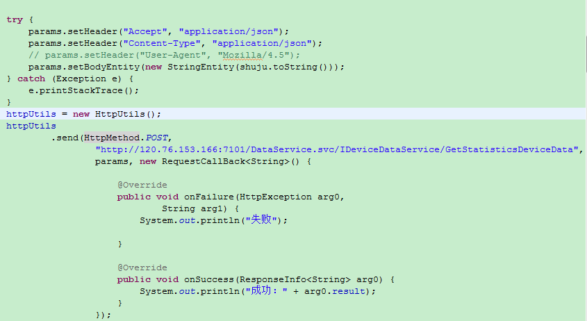
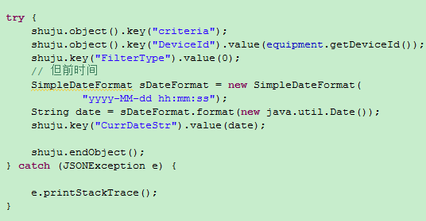
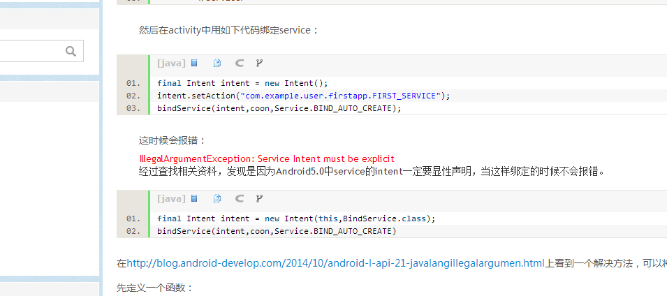
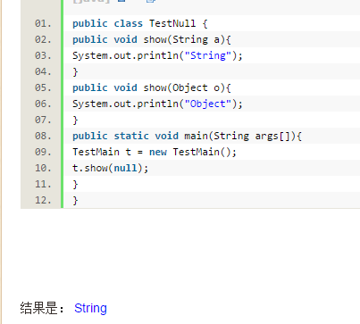
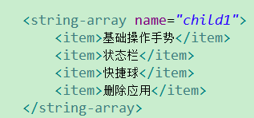
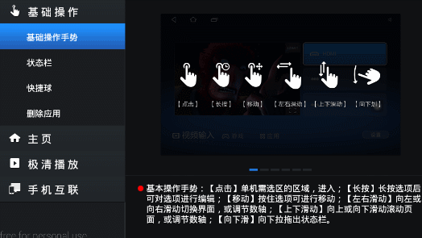
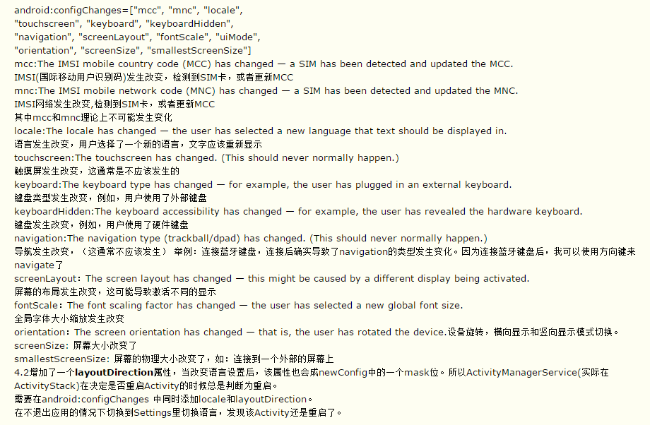
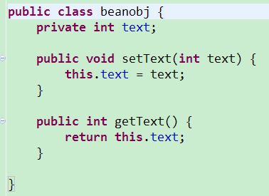
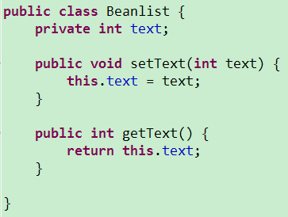
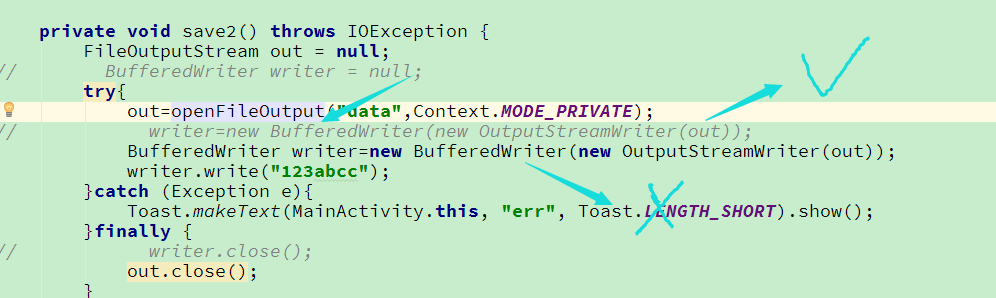

#### 1. eAndroid 获取WCF(.net)数据
> 我已经忘了这个是用来干嘛的了

wcf模式必须要添加头文件
```java
params.setHeader("Accept", "application/json");

params.setHeader("Content-Type", "application/json");

// params.setHeader("User-Agent", "Mozilla/4.5");

//添加实体参数：

params.setBodyEntity(new StringEntity(shuju.toString()));
```




---
#### 2. AsyncTask 了解

参考：<http://blog.csdn.net/liuhe688/article/details/6532519>

一个异步任务的执行一般包括以下几个步骤：

1. **execute(Params... params)**，执行一个异步任务，需要我们在代码中调用此方法，触发异步任务的执行。

2. **onPreExecute()**，在execute(Params... params)被调用后立即执行，一般用来在执行后台任务前对UI做一些标记。

3. **doInBackground(Params... params)**，在onPreExecute()完成后立即执行，用于执行较为费时的操作，此方法将接收输入参数和返回计算结果。在执行过程中可以调用publishProgress(Progress... values)来更新进度信息。

4. **onProgressUpdate(Progress... values)**，在调用publishProgress(Progress... values)时，此方法被执行，直接将进度信息更新到UI组件上。

5. **onPostExecute(Result result)**，当后台操作结束时，此方法将会被调用，计算结果将做为参数传递到此方法中，直接将结果显示到UI组件上。

###### 在使用的时候，有几点需要格外注意：

1. 异步任务的实例必须在UI线程中创建。

2. execute(Params... params)方法必须在UI线程中调用。

3. 不要手动调用onPreExecute()，doInBackground(Params... params)，onProgressUpdate(Progress... values)，onPostExecute(Result result)这几个方法。

4. 不能在doInBackground(Params... params)中更改UI组件的信息。

5. 一个任务实例只能执行一次，如果执行第二次将会抛出异常。

---
#### 3. [**getIdentifier()**](http://www.cnblogs.com/mybkn/archive/2012/05/30/2526375.html)

项目中一问题，从获取图片名称后，然后调用图片。直接用R.drawable.?无法调用。解决：

主要由两种方法，个人建议第二种。 

1. 不把图片放在res/drawable下，而是存放在src某个package中（如：com.drawable.resource），这种情况下的调用方法为： 

```java

String path = "com/drawable/resource/imageName.png"; 

InputStream is = getClassLoader().getResourceAsStream(path); 

Drawable.createFromStream(is, "src"); 

```


2. 如果还是希望直接使用res/drawable中的图片，就需要通过下面的方法了： 

假设创建工程的时候，填写的package名字为：com.test.image 
```java
int resID = getResources().getIdentifier("imageName", "drawable", "com.test.image"); 
Drawable image = getResources().getDrawable(resID);


eg:getResources().getIdentifier("mymediacontroller","layout",getContext().getPackageName()
getResources().getIdentifier("mediacontroller_top_back", "id",context.getPackageName())
```

---
#### 4. **ArrayList.clone();**

**ArrayList.clone();为真正的复制**

**ArrayList=ArrayList2；这样只是复制一个地址，当ArrayList中的一个数据发生改变，ArrayList2也回随着改变。**

---
#### 5. 长亮不熄屏
```java
PowerManager pm = (PowerManager) this.getSystemService(Context.POWER_SERVICE);

PowerManager.WakeLock mWakeLock = pm.newWakeLock(PowerManager.SCREEN_DIM_WAKE_LOCK, "My " + "Tag");

mWakeLock.acquire();
```
需要添加权限：<uses-permission android:name="android.permission.WAKE_LOCK"/>

---
#### 6. 返回桌面跳转
```java
	Intent intent = new Intent(Intent.ACTION_MAIN);

    intent.setFlags(Intent.FLAG_ACTIVITY_NEW_TASK);// 注意

    intent.addCategory(Intent.CATEGORY_HOME);

    this.startActivity(intent);
```

---
#### 7. Android 5.0之后启动server只能用显示启动不能用隐示启动



---
#### 8. ViewPager发现setOnPageChangeListener的方法居然过期了，而且AS编译不通过了，最后查了一下原来把set换成add了

---
#### 9. 关于java重载函数，参数为null时，调用的处理。（精确性原则）

[java的多态——null参数会调用哪个方法？](http://blog.csdn.net/zchuanzhao/article/details/48805561)



---
#### 10. 将Xml里面的array转换成list：
```java
ArrayList<String> list = new ArrayList<String>(

Arrays.asList(getResources().getStringArray(R.array.child1)));
```



---
#### 11. 打开assets文件并且返回String：
```java
private String openAssets(String s) {

        try {
            InputStreamReader reader = new InputStreamReader(getAssets()
                    .open(s), "UTF-8");
            BufferedReader bufferedReader = new BufferedReader(reader);
            String read;
            StringBuilder builder = new StringBuilder();
            while ((read = bufferedReader.readLine()) != null) {
                builder.append(read);
            }
            bufferedReader.close();
            reader.close();
            return builder.toString();
        } catch (IOException e) {
            Log.e(TAG, "IO err");
            return "IO err";
        }
    }
```

---
#### 12. [android 使用Notification弹多个通知时，点击跳转intent取值时总是最后一个](http://blog.csdn.net/iwuyuetian/article/details/51207356)

---
#### 13. Android textview里面添加图片：

[Android TextView里直接显示图片的三种方法](http://blog.csdn.net/yanzi1225627/article/details/24590029)

---
#### 14. values-styles常用方法

<item name="android:windowNoTitle">true</item>//设置不显示标题栏title

**api 19（4.4+）**

android:windowTranslucentStatus //顶部状态栏透明否

android:windowTranslucentNavigation//底部导航栏透明否

注：使用了透明栏后布局文件会从透明区域开始绘制，需要在最外层布局中添加android:fitsSystemWindows="true"方法，会使内部view按照正常绘制（不包括最外层）。

**api21（5.1+）**

android:statusBarColor//状态栏颜色

android:navigationBarColor//导航栏颜色

注：使用上面两个方法需要将

<item name="android:windowDrawsSystemBarBackgrounds">false</item>设置为true才会生效

或者透明状态为关闭会生效

---
#### 15. 切换语言、横竖屏幕切换等导致的问题，资源切换重新加载activity。

问题如图：




造成原因，当切换语言后，activity会先把之前的销毁掉（destroy），然后重新执行created，但是为什么会有部分还停留在之前的状态呢（暂时不明，估计是在destroy时候没有清除对应的资源）。

（当程序运行时，设备配置的改变会导致当前Activity被销毁并重新创建。在Activity被销毁之前我们需要保存当前的数据以防Activity重建后数据丢失。例如界面中用户选择了checkbox和radiobutton选项或者通过网络请求显示在界面上的数据在屏幕旋转后Activity被destroy-recreate，这些控件上被选择的状态和界面上的数据都会消失。再比如当进入某个Activity时加载页面进行网络请求，此时旋转屏幕会重新创建网络连接请求，这样的用户体验非常不好。而且常见的一个问题是如果伴随异步操作显示一个progressDialog的话，异步任务未完成去旋转屏幕，程序会因为Activity has leaked window 而终止。而当old Activity被销毁后，线程执行完毕后还是会把结果返回给old Activity而非新的Activity，而且新的Activity如果又触发了后台任务(在onCreate()中会启动线程)，就又会去启动一个子线程，消耗可用的资源。）


**解决办法：**

解决办法一是避免让activity重新创建。需要在AcndroidManifest里面添加android:configChanges方法常用方法：



当添加了对应事件之后，触发将不会在重新创建而是直接执行`onConfigurationChanged(Configuration newConfig)`方法，所以如果有需要改动的数据可以在里面手动改变。参考：[Android Configuration change引发的问题及解决方法](http://blog.csdn.net/aliaooooo/article/details/23606179)

---
#### 16. Gson解析json

gson常规用法，mData = gson.fromJson(jsonstr, MyData.class);

使用工具类：

[DataFactory.java](./Android日常笔记二/DataFactory.java)

使用方法：

- 普通json：
```java
	beanobj beanob = (beanobj) DataFactory.getInstanceByJson(beanobj.class,"{\"text\":1}");

    System.out.println("o:" + beanob.getText());
```


- 数组json：
```java
        ArrayList<Beanlist> arrayList = DataFactory.jsonToArrayList("[{\"text\":1}]", Beanlist.class);
        System.out.println("L:" + arrayList.get(0).getText());
```


---
#### 17. Eclipse 当选中一个文件点击run还是运行上次运行的项目问题：

windows->preferences->搜索栏打上launching，然后在Launch Operation，选中Launch the associated project就行了

---
#### 18. Android中对view使用旋转setRotation属性时候默认是以中心旋转，View.setPivotX和View.setPivotY方法可以手动设置中心点。起点为view左上角（0，0）；

---
#### 19. Eclipse编辑快速输入：
Windown -->Preferences --> java --> Editor --> templates

---
#### 20. 自定义View宽高定测
```java
@Override

​    protected void onMeasure(int widthMeasureSpec, int heightMeasureSpec) {
​        int desiredWidth = width;
​        int desiredHeight = height;
​        int widthMode = MeasureSpec.getMode(widthMeasureSpec);
​        int widthSize = MeasureSpec.getSize(widthMeasureSpec);
​        int heightMode = MeasureSpec.getMode(heightMeasureSpec);
​        int heightSize = MeasureSpec.getSize(heightMeasureSpec);
​        int width;
​        int height;

​        // Measure Width
​        if (widthMode == MeasureSpec.EXACTLY) {
​            // Must be this size
​            width = widthSize;
​        } else if (widthMode == MeasureSpec.AT_MOST) {
​            // Can't be bigger than...
​            width = Math.min(desiredWidth, widthSize);
​        } else {
​            // Be whatever you want
​            width = desiredWidth;
​        }

​        // Measure Height
​        if (heightMode == MeasureSpec.EXACTLY) {
​            // Must be this size
​            height = heightSize;
​        } else if (heightMode == MeasureSpec.AT_MOST) {
​            // Can't be bigger than...
​            height = Math.min(desiredHeight, heightSize);
​        } else {
​            // Be whatever you want
​            height = desiredHeight;
​        }

​        // MUST CALL THIS
​        setMeasuredDimension(width, height);
​    }
```

---
#### 21. java 给View添加xml属性(设置View属性)
> 本例为代码创建view，若修改现有的view可以用`v.getLayoutParams();`获取。
```java
RelativeLayout.LayoutParams rlp=new RelativeLayout.LayoutParams(RelativeLayout.LayoutParams.WRAP_CONTENT,RelativeLayout.LayoutParams.WRAP_CONTENT);  
​        rlp.addRule(RelativeLayout.CENTER_IN_PARENT);//addRule参数对应RelativeLayout XML布局的属性  
​        relativeLayout.addView(progressBar,rlp); 
//Gravity.CENTER
```
---
#### 22. android .9图显示区域问题。
按理说左上是必选，右下是可选，左上控制拉伸，右下控制显示区域，如果不设置右下，左上区域也作用于显示（右下）区域。

---
#### 23. View创建过程图：


---
#### 24. 在Oncreate里面获取控件宽高，参考[**Android 获取控件的宽和高**](http://blog.csdn.net/johnny901114/article/details/7839512)

例一：
```java
 int w = View.MeasureSpec.makeMeasureSpec(0,View.MeasureSpec.UNSPECIFIED);  
 int h = View.MeasureSpec.makeMeasureSpec(0,View.MeasureSpec.UNSPECIFIED);  
 imageView.measure(w, h);  
 int height =imageView.getMeasuredHeight();  
 int width =imageView.getMeasuredWidth();  
 textView.append("\n"+height+","+width);  
```
---
#### 25. dp转换px
```jvva
private int dp2px(Context context, float dp) {
​        final float scale = context.getResources().getDisplayMetrics().density;
​        return (int) (dp * scale + 0.5f);
​    }
```
---
#### 26. Math开多次方
```java
double x=27,y=3;

double z = Math.pow(x,1.0/y); //x为被开方的数，1.0/y为要开方的次数

System.out.println("27被开3次方为："+z);
```
**这里要强调一下`1.0/y`被1除才是开方，否则就是次方（27的3次方）**

> 这个知识以前学过的。。但是忘了啊啊啊啊啊啊
>
> * Math.sqrt();为开平方根。

---
#### 27. 日常坑1：openFileOutput方法生成img文件不能直接用文件管理器在data/data/包名 里面打开，会打不开。。或者打开显示不出来。。复制出来就好了。

坑2： 



为什么在try里面声明的BufferedWriter用write方法写不进去数据也没用抛出异常。但是在try外面声明然后调用write方法就可以写入数据？

原因：关闭流的顺序错误了。要先开的后关。如果先开的流先关闭了，会导致后面开的流失效。

---
#### 28. /**[Java日期转换SimpleDateFormat格式大全](http://blog.csdn.net/yeshanghai_c/article/details/8974063)

  SimpleDateFormat函数语法：


  G 年代标志符

  y 年

  M 月

  d 日

  h 时 在上午或下午 (1~12)

  H 时 在一天中 (0~23)

  m 分

  s 秒

  S 毫秒

  E 星期

  EEEE 周一

  D 一年中的第几天

  F 一月中第几个星期几

  w 一年中第几个星期

  W 一月中第几个星期

  a 上午 / 下午 标记符 

  k 时 在一天中 (1~24)

  K 时 在上午或下午 (0~11)

  z 时区

 */

---
#### 29. requestFocus获取焦点的只能有一个控件，如果是组合控件，只是外层获取了焦点内部控件也不会有焦点。

---
#### 30. 不要在一个类里面多次给静态变量赋值，静态变量在当前进程被终止之前不会被回收。
