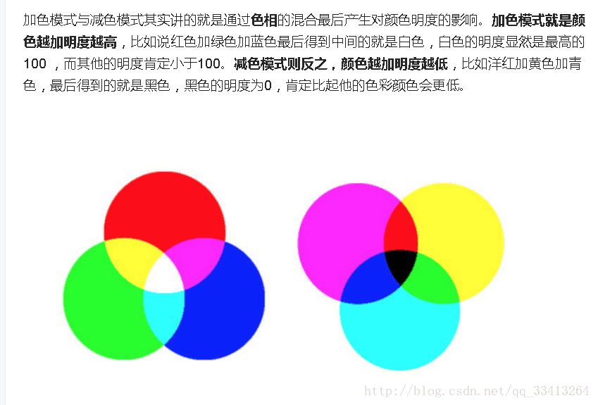
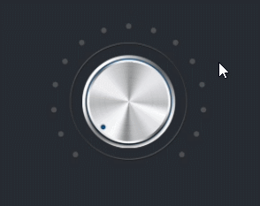
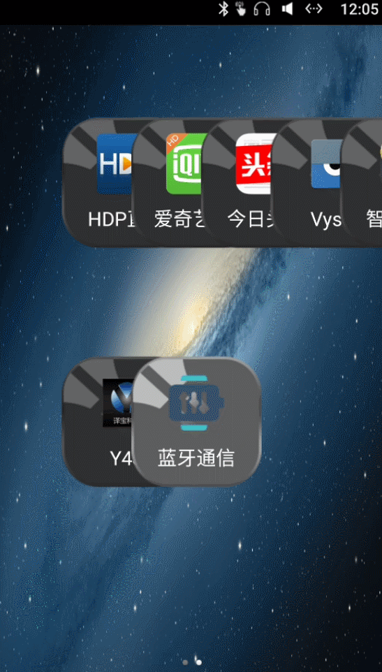
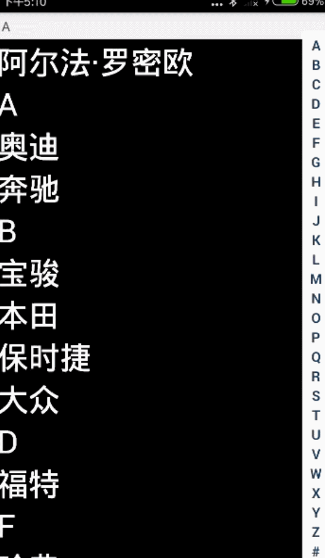
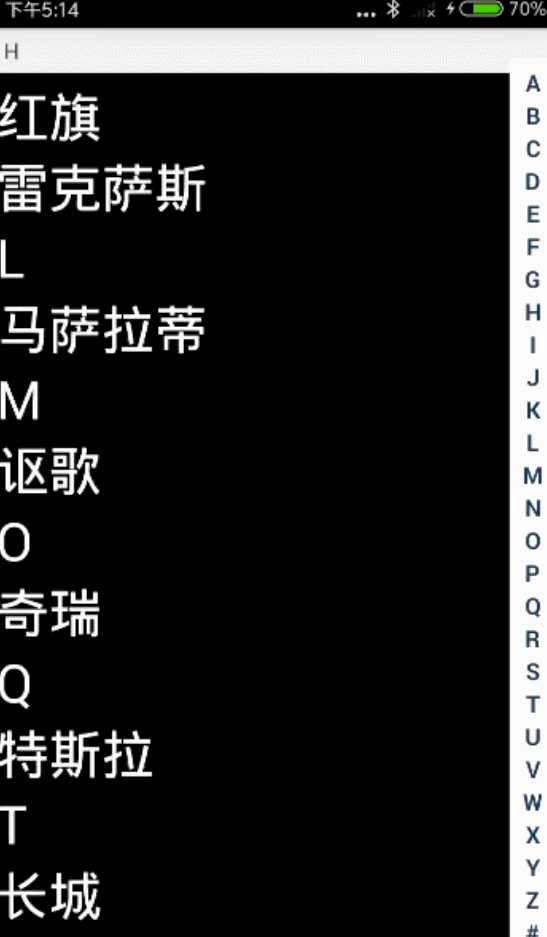
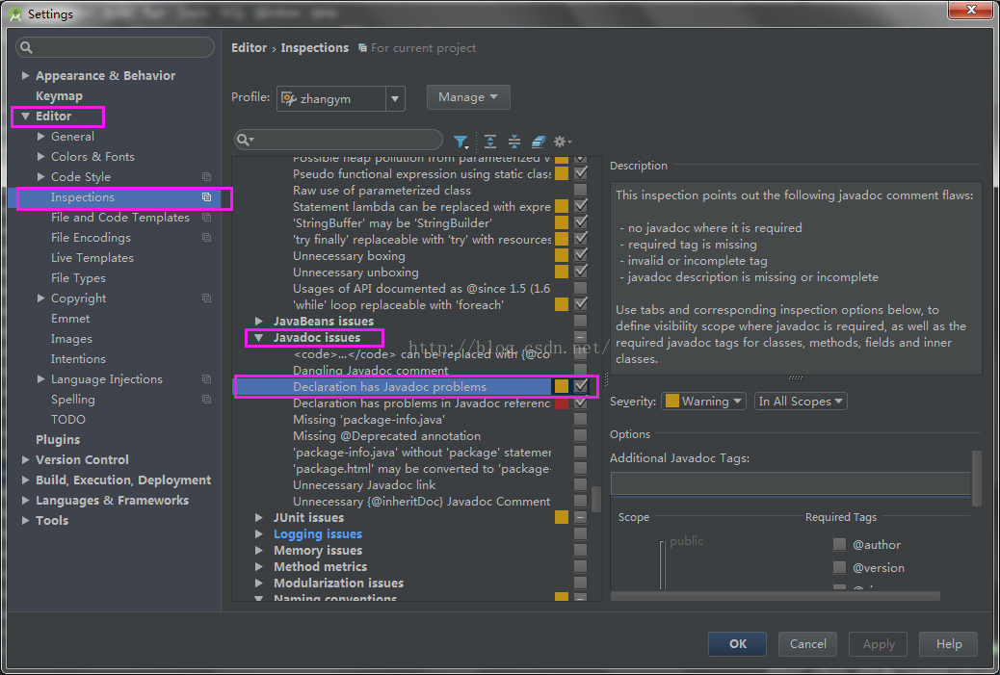
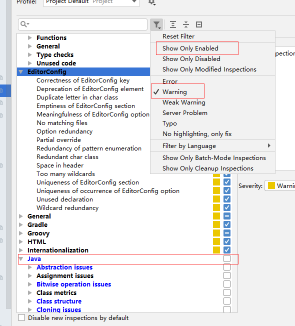

# Android 日常笔记六

#### 1. 为什么#FFFFFF是白色不是黑色。
> 有点日常知识的我都知道，三原色 颜料颜色，混合在一起就是黑色。  
> 小时候玩颜料 就有深刻印象。

  后来查看了资料：
```text
（三原色）
颜料三原色——减色法原理
　　而在打印、印刷、油漆、绘画等靠介质表面的反射被动发光的场合， 物体所呈现的颜色是光源中被颜料吸收后所剩余的部分， 所以其成色的原理叫做减色法原理。 减色法原理被广泛应用于各种被动发光的场合。 在减色法原理中的三原色颜料分别是青（Cyan）、品红（Magenta）和黄（Yellow）。
（三基色）
色光三原色——加色法原理
　　人的眼睛是根据所看见的光的波长来识别颜色的。 可见光谱中的大部分颜色可以由三种基本色光按不同的比例混合而成， 这三种基本色光的颜色就是红（Red）、绿（Green）、 蓝（Blue）三原色光。这三种光以相同的比例混合、且达到一定的强度， 就呈现白色（白光）；若三种光的强度均为零， 就是黑色（黑暗）。这就是加色法原理，加色法原理被广泛应用于电视机、监视器等主动发光的产品中。
```
[参考资料：](https://blog.csdn.net/qq_33413264/article/details/75426358)  


> 所以说光是三基色，颜料是三原色。

---
#### 2. 自定义控件之--按钮旋转
> 首先是有这样的一个需求 如图：
  

网上找的参考资料：  
- [Android对图片进行平移，缩放，旋转操作](https://www.cnblogs.com/andlp/p/5972260.html) --> [源码下载地址](https://raw.githubusercontent.com/516457377/Note/master/Android/Android%E6%97%A5%E5%B8%B8%E7%AC%94%E8%AE%B0%E5%85%AD/com.maneater.picscreator.zip)（这个有源码，但是实现方式比较复杂稍微看了下没用）  


- [android控件随手势旋转](https://www.jianshu.com/p/e0ab33ea0431) （现在用的是这个里面的方法）  

详细实现：

```java
    /**
     * 根据坐标系中的3点确定夹角的方法（注意：夹角是有正负的）
     * @param cen 旋转的中心点
     * @param first 起始点
     * @param second 结束点
     * @return 返回旋转的角度具有方向
     */
    public float angle(PointF cen, PointF first, PointF second) {
        float dx1, dx2, dy1, dy2;

        dx1 = first.x - cen.x;
        dy1 = first.y - cen.y;
        dx2 = second.x - cen.x;
        dy2 = second.y - cen.y;

        // 计算三边的平方
        float ab2 = (second.x - first.x) * (second.x - first.x) + (second.y - first.y) * (second.y - first.y);
        float oa2 = dx1 * dx1 + dy1 * dy1;
        float ob2 = dx2 * dx2 + dy2 * dy2;
        // 根据两向量的叉乘来判断顺逆时针
        boolean isClockwise = ((first.x - cen.x) * (second.y - cen.y) - (first.y - cen.y) * (second.x - cen.x)) > 0;

        // 根据余弦定理计算旋转角的余弦值
        double cosDegree = (oa2 + ob2 - ab2) / (2 * Math.sqrt(oa2) * Math.sqrt(ob2));

        // 异常处理，因为算出来会有误差绝对值可能会超过一，所以需要处理一下
        if (cosDegree > 1) {
            cosDegree = 1;
        } else if (cosDegree < -1) {
            cosDegree = -1;
        }

        // 计算弧度
        double radian = Math.acos(cosDegree);
        // 计算旋转过的角度，顺时针为正，逆时针为负
        return (float) (isClockwise ? Math.toDegrees(radian) : -Math.toDegrees(radian));

    }
```

代码我就不做讲解了，也不是我写的，有学霸自然看得懂。但是有几个值得注意的地方着重讲下：

- 三个点的获取方式：AB点的获取比较简单，主要是pointCenter点和event.getY()/event.getRawY()的区别。  
如果使用的是getY()，也就是当前view的左上角为原点的坐标，这时候pointCenter点就很好算了直接是`img.getWidth() / 2, img.getHeight() / 2`如果使用的是getRawY()，那么中心点就是`img.getLeft()+img.getWidth() / 2, img.getTop()+img.getHeight() / 2`
```java
    case MotionEvent.ACTION_DOWN:
    lastX = event.getX();
    lastY = event.getY();
    pointCenter = new PointF(img.getWidth() / 2, img.getHeight() / 2);
    break;
    case MotionEvent.ACTION_MOVE:
    pointA = new PointF(lastX, lastY);
    pointB = new PointF(event.getX(), event.getY());

    float v1 = angle(pointCenter, pointA, pointB) + img.getRotation();
    //限制旋转的角度
    v1 = v1 > 270 ? 270 : v1;
    v1 = v1 < 0 ? 0 :v1;

    img.setRotation(v1);

    toast(v1 + "___" + (int) pointB.x + "__" + (int) pointCenter.y);
    lastX = event.getX();
    lastY = event.getY();
    break;
```
- 在demo里面实现旋转是点击外部某个按钮才实现旋转，我需要实现的是在控件内部直接旋转。所以当我在imgView上面直接使用OnTouchListener里面操作的时候，出现了一个问题就是，旋转很不流畅有抖动，具体原因未知，个人猜测是，因为在view上面的touch事件的event值当setRotation旋转的时候也会有所改变导致抖动。最后解决方案是在imgview上面覆盖一个view，使用view的触摸监听来控制imgview旋转。问题解决。 
```xml
     <ImageView
        android:id="@+id/img"
        android:layout_width="wrap_content"
        android:layout_height="wrap_content"
        android:layout_centerInParent="true"
        android:src="@drawable/knobview" />

    <View
        android:id="@+id/img_view"
        android:layout_width="250dp"
        android:layout_height="250dp"
        android:layout_centerInParent="true" />
```

---
#### 3. 自定义控件之--跟随雷达波纹
> 这是第二个需要制作的控件
待完成。。。

---
#### 4. Android instanceof 运算符
> instanceof 是一个关键字，用于判断、检测一个对象是否为某个类的实例对象。  
> 举个栗子：你定义了很多button，和点击方法：
```java
public void onClick(View v) {
	if(v instanceof button1){//判断V是否为此button的实例。
	 ***
	}
}

```

---
#### 5. Android app启动去掉有白屏、Tittle界面。
  先看看问题如图：
[参考链接](https://blog.csdn.net/cdhahaha/article/details/56012325)

  

相信你看得很清楚了，我的主界面是没有Title的，但是启动过程中还是会显示一下。
介是为什么呢？ 根据[某CSDN描述](https://www.csdn.net/gather_29/MtTakg4sNDkwOS1ibG9n.html)    

> 好像会先加载android主题然后才执行onCreate方法显示界面

也就是说我的`requestWindowFeature(Window.FEATURE_NO_TITLE);`优先级并不够高。
文中也给出了一种解决方案：
```xml
 <style name="Theme.BackgroundTranslucent" parent="@android:Theme.Translucent">
    <item name="android:windowBackground">@null</item>
    <item name="android:windowNoTitle">true</item>
</style> 
```
然后给启动的Activity设置成此主题。确实问题解决了。最主要的就是在主题中添加：`windowBackground`和`windowNoTitle`。

---

#### 6. Android获取定位权限，手动打开GPS

```java
/**检查是否打开GPS*/
private boolean checkGpsIsOpen() {
        boolean isOpen;
        LocationManager locationManager = (LocationManager) this.getSystemService(Context.LOCATION_SERVICE);
        isOpen = locationManager.isProviderEnabled(LocationManager.GPS_PROVIDER);
        return isOpen;
    }

/**打开GPS跳转*/
	private void openGPSSEtting() {
        if (checkGpsIsOpen()){
            Toast.makeText(this, "true", Toast.LENGTH_SHORT).show();
        }else {
            new AlertDialog.Builder(this).setTitle("open GPS")
                    .setMessage("go to open")
                    //  取消选项
                    .setNegativeButton("cancel",new DialogInterface.OnClickListener(){

                        @Override
                        public void onClick(DialogInterface dialogInterface, int i) {
                            Toast.makeText(MainActivity.this, "close", Toast.LENGTH_SHORT).show();
                            // 关闭dialog
                            dialogInterface.dismiss();
                        }
                    })
                    //  确认选项
                    .setPositiveButton("setting", new DialogInterface.OnClickListener() {
                        @Override
                        public void onClick(DialogInterface dialogInterface, int i) {
                          //跳转到手机原生设置页面
                            Intent intent = new Intent(Settings.ACTION_LOCATION_SOURCE_SETTINGS);
                            startActivityForResult(intent,GPS_REQUEST_CODE);
                        }
                    })
                    .setCancelable(false)
                    .show();
        }
    }
    
/**返回跳转结果*/
	@Override
    protected void onActivityResult(int requestCode, int resultCode, @Nullable Intent data) {
        super.onActivityResult(requestCode, resultCode, data);
        if (requestCode ==GPS_REQUEST_CODE){
            openGPSSEtting();
        }
    }

```

---

#### 7.Android BLE4.+

https://blog.csdn.net/u014418171/article/details/81219297
https://www.jianshu.com/p/795bb0a08beb

---

#### 8. launchMode


---

#### 9. 点九 .9图制作“右下放，左上伸”。

---

#### 10. 在Android 5.0之前使用Dialog

今天在兼容Android4.4的时候发现

`dialog.create();`会报错，`NoSuchMethodError`提示找不到这个方法。看了源码后发现没有这个方法，但是在show的时候会调用，create里面的构造方法，这样的话就不能传参了。

```java
dialog.show();
dialog.setData(data);
```

尝试后发现可以先show创建了窗口后再添加数据也是可以的。

---

#### 11. ListView 关于滚动时候会有重影

先看看具体问题/解决后：

  

>  问题很明显，但是为什么泥，我做了很多测试，新建了一个项目新建了一个listview，跑起来正常，然后原本复制过来，跑起来还是有拖影，这时候就可以排除list view的问题了。其他问题的话我就智能猜到主题了，试了一下果然是因为主题。因为之前改过启动黑屏问题，把背景设置成null了`<item name="android:windowBackground">@null</item>`导致没有背景，所以会把有的元素直接印在背景上面。

上面的都是废话，解决办法也很简单。。在layout上面加个`android:background="#000000"`就可以了。

---
#### 12. Android 获取本地软件版本号。(Version)
```java
	/*
     * 获取当前程序的版本号
     */
    public static int getVersionCode(Context mContext) {
        int versionCode = 0;
        try {
            //获取软件版本号，对应AndroidManifest.xml下android:versionCode
            versionCode = mContext.getPackageManager().
                    getPackageInfo(mContext.getPackageName(), 0).versionCode;
        } catch (PackageManager.NameNotFoundException e) {
            e.printStackTrace();
        }
        return versionCode;
    }
//获取版本号名称（对应versionName）
    public static String getVerName(Context context) {
        String verName = "";
        try {
            verName = context.getPackageManager().
                    getPackageInfo(context.getPackageName(), 0).versionName;
        } catch (PackageManager.NameNotFoundException e) {
            e.printStackTrace();
        }
        return verName;
    }
```

---

#### 13. Android AS 隐藏右侧速览黄色警告。

如图：在AS里面这种警告实在太多了，导致自己的TODO标记，或者选择同名变量的时候大量混在一起难以分清。


网上找了一下：[如何去掉Android Studio的注释警告](https://blog.csdn.net/zhangym90/article/details/52181750)  

网上的步骤：

> 具体步骤：File->Settings->Editor->Inspections,在右侧找到Javadoc issues下的Declaration has Javadoc problems右侧的勾去掉然后点击Apply或者OK即可。
>
> 

试了下并不能隐藏掉我所谓的大量提示。

于是乎：我把java的黄色提醒全部隐藏掉：ojbk




**PS: `Java - Deprecated API usage`这个可以勾上，用来显示废弃的代码。  getResources().~~getDrawable~~(R.drawable.btn_bg);**

---
#### 14. Android 拷贝文件之createNewFile异常Not a directory
今天遇到了一个奇怪的问题在需要拷贝一个文件到`/sdcard/baiduTTS/a.dat`目录，但是以开始忘记要先`f.mkdirs()`，创建路径文件，然后`fb.createNewFile();`创建需要拷贝的文件，后来修改了之后确发现，createNewFile创建的时候提示异常Not a directory，并且mkdirs也提示创建失败，但是根本没有baiduTTS这个文件夹，找了半天才发现原来根目录下面已经有了一个叫baiduTTS的文件，果断删除后发现，问题解决。
PS：拷贝文件最主要的是需要创建路径文件。`f.mkdirs()`，createNewFile可以不用调用，直接拷贝也会创建。

```java
		out = new FileOutputStream(fb);
        byte buffer[] = new byte[1024];
        while (in.read(buffer) >= 0) {
            out.write(buffer);
            }
```

---
#### 15. Android Studio添加aar依赖
> 网上找了很多大部分都是老版本的，不太一样。
https://www.cnblogs.com/jooy/p/9489527.html
第一种:
```groovy
android{
    repositories {
        flatDir {
            dirs 'libs'
        }
    }
}
dependencies {
    implementation fileTree(include: ['*.jar'], dir: 'libs')
    implementation (name: 'barcode_scanner_library_v2.3.2.0', ext: 'aar')
}
```
第二种:
```groovy
android{
   //不用写
   /* repositories {
        flatDir {
            dirs 'libs'
        }
    }*/
}
dependencies {
　    将
     implementation fileTree(dir: 'libs', include: ['*.jar'])
     改为
     implementation fileTree(dir: 'libs', include: ['*.jar','*.aar'])
}
```

---