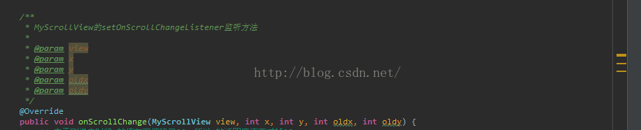

# Android 日常笔记六

#### 1. 为什么#FFFFFF是白色不是黑色。
> 有点日常知识的我都知道，三原色 颜料颜色，混合在一起就是黑色。  
> 小时候玩颜料 就有深刻印象。

  后来查看了资料：
```text
（三原色）
颜料三原色——减色法原理
　　而在打印、印刷、油漆、绘画等靠介质表面的反射被动发光的场合， 物体所呈现的颜色是光源中被颜料吸收后所剩余的部分， 所以其成色的原理叫做减色法原理。 减色法原理被广泛应用于各种被动发光的场合。 在减色法原理中的三原色颜料分别是青（Cyan）、品红（Magenta）和黄（Yellow）。
（三基色）
色光三原色——加色法原理
　　人的眼睛是根据所看见的光的波长来识别颜色的。 可见光谱中的大部分颜色可以由三种基本色光按不同的比例混合而成， 这三种基本色光的颜色就是红（Red）、绿（Green）、 蓝（Blue）三原色光。这三种光以相同的比例混合、且达到一定的强度， 就呈现白色（白光）；若三种光的强度均为零， 就是黑色（黑暗）。这就是加色法原理，加色法原理被广泛应用于电视机、监视器等主动发光的产品中。
```
[参考资料：](https://blog.csdn.net/qq_33413264/article/details/75426358)  


> 所以说光是三基色，颜料是三原色。

---
#### 2. 自定义控件之--按钮旋转
> 首先是有这样的一个需求 如图：
  

网上找的参考资料：  
- [Android对图片进行平移，缩放，旋转操作](https://www.cnblogs.com/andlp/p/5972260.html) --> [源码下载地址](https://raw.githubusercontent.com/516457377/Note/master/Android/Android%E6%97%A5%E5%B8%B8%E7%AC%94%E8%AE%B0%E5%85%AD/com.maneater.picscreator.zip)（这个有源码，但是实现方式比较复杂稍微看了下没用）  


- [android控件随手势旋转](https://www.jianshu.com/p/e0ab33ea0431) （现在用的是这个里面的方法）  

详细实现：

```java
    /**
     * 根据坐标系中的3点确定夹角的方法（注意：夹角是有正负的）
     * @param cen 旋转的中心点
     * @param first 起始点
     * @param second 结束点
     * @return 返回旋转的角度具有方向
     */
    public float angle(PointF cen, PointF first, PointF second) {
        float dx1, dx2, dy1, dy2;

        dx1 = first.x - cen.x;
        dy1 = first.y - cen.y;
        dx2 = second.x - cen.x;
        dy2 = second.y - cen.y;

        // 计算三边的平方
        float ab2 = (second.x - first.x) * (second.x - first.x) + (second.y - first.y) * (second.y - first.y);
        float oa2 = dx1 * dx1 + dy1 * dy1;
        float ob2 = dx2 * dx2 + dy2 * dy2;
        // 根据两向量的叉乘来判断顺逆时针
        boolean isClockwise = ((first.x - cen.x) * (second.y - cen.y) - (first.y - cen.y) * (second.x - cen.x)) > 0;

        // 根据余弦定理计算旋转角的余弦值
        double cosDegree = (oa2 + ob2 - ab2) / (2 * Math.sqrt(oa2) * Math.sqrt(ob2));

        // 异常处理，因为算出来会有误差绝对值可能会超过一，所以需要处理一下
        if (cosDegree > 1) {
            cosDegree = 1;
        } else if (cosDegree < -1) {
            cosDegree = -1;
        }

        // 计算弧度
        double radian = Math.acos(cosDegree);
        // 计算旋转过的角度，顺时针为正，逆时针为负
        return (float) (isClockwise ? Math.toDegrees(radian) : -Math.toDegrees(radian));

    }
```

代码我就不做讲解了，也不是我写的，有学霸自然看得懂。但是有几个值得注意的地方着重讲下：

- 三个点的获取方式：AB点的获取比较简单，主要是pointCenter点和event.getY()/event.getRawY()的区别。  
如果使用的是getY()，也就是当前view的左上角为原点的坐标，这时候pointCenter点就很好算了直接是`img.getWidth() / 2, img.getHeight() / 2`如果使用的是getRawY()，那么中心点就是`img.getLeft()+img.getWidth() / 2, img.getTop()+img.getHeight() / 2`
```java
    case MotionEvent.ACTION_DOWN:
    lastX = event.getX();
    lastY = event.getY();
    pointCenter = new PointF(img.getWidth() / 2, img.getHeight() / 2);
    break;
    case MotionEvent.ACTION_MOVE:
    pointA = new PointF(lastX, lastY);
    pointB = new PointF(event.getX(), event.getY());

    float v1 = angle(pointCenter, pointA, pointB) + img.getRotation();
    //限制旋转的角度
    v1 = v1 > 270 ? 270 : v1;
    v1 = v1 < 0 ? 0 :v1;

    img.setRotation(v1);

    toast(v1 + "___" + (int) pointB.x + "__" + (int) pointCenter.y);
    lastX = event.getX();
    lastY = event.getY();
    break;
```
- 在demo里面实现旋转是点击外部某个按钮才实现旋转，我需要实现的是在控件内部直接旋转。所以当我在imgView上面直接使用OnTouchListener里面操作的时候，出现了一个问题就是，旋转很不流畅有抖动，具体原因未知，个人猜测是，因为在view上面的touch事件的event值当setRotation旋转的时候也会有所改变导致抖动。最后解决方案是在imgview上面覆盖一个view，使用view的触摸监听来控制imgview旋转。问题解决。 
```xml
     <ImageView
        android:id="@+id/img"
        android:layout_width="wrap_content"
        android:layout_height="wrap_content"
        android:layout_centerInParent="true"
        android:src="@drawable/knobview" />

    <View
        android:id="@+id/img_view"
        android:layout_width="250dp"
        android:layout_height="250dp"
        android:layout_centerInParent="true" />
```

---
#### 3. 自定义控件之--跟随雷达波纹:smiley:待完善
> 这是第二个需要制作的控件
待完成。。。

---
#### 4. Android instanceof 运算符
> instanceof 是一个关键字，用于判断、检测一个对象是否为某个类的实例对象。  
> 举个栗子：你定义了很多button，和点击方法：
```java
public void onClick(View v) {
	if(v instanceof button1){//判断V是否为此button的实例。
	 ***
	}
}

```
这个栗子举的不对。

---
#### 5. Android app启动去掉有白屏、Tittle界面。
  先看看问题如图：
[参考链接](https://blog.csdn.net/cdhahaha/article/details/56012325)

  

相信你看得很清楚了，我的主界面是没有Title的，但是启动过程中还是会显示一下。
介是为什么呢？ 根据[某CSDN描述](https://www.csdn.net/gather_29/MtTakg4sNDkwOS1ibG9n.html)    

> 好像会先加载android主题然后才执行onCreate方法显示界面

也就是说我的`requestWindowFeature(Window.FEATURE_NO_TITLE);`优先级并不够高。
文中也给出了一种解决方案：
```xml
 <style name="Theme.BackgroundTranslucent" parent="@android:Theme.Translucent">
    <item name="android:windowBackground">@null</item>
    <item name="android:windowNoTitle">true</item>
</style> 
```
然后给启动的Activity设置成此主题。确实问题解决了。最主要的就是在主题中添加：`windowBackground`和`windowNoTitle`。

---

#### 6. Android获取定位权限，手动打开GPS

```java
/**检查是否打开GPS*/
private boolean checkGpsIsOpen() {
        boolean isOpen;
        LocationManager locationManager = (LocationManager) this.getSystemService(Context.LOCATION_SERVICE);
        isOpen = locationManager.isProviderEnabled(LocationManager.GPS_PROVIDER);
        return isOpen;
    }

/**打开GPS跳转*/
	private void openGPSSEtting() {
        if (checkGpsIsOpen()){
            Toast.makeText(this, "true", Toast.LENGTH_SHORT).show();
        }else {
            new AlertDialog.Builder(this).setTitle("open GPS")
                    .setMessage("go to open")
                    //  取消选项
                    .setNegativeButton("cancel",new DialogInterface.OnClickListener(){

                        @Override
                        public void onClick(DialogInterface dialogInterface, int i) {
                            Toast.makeText(MainActivity.this, "close", Toast.LENGTH_SHORT).show();
                            // 关闭dialog
                            dialogInterface.dismiss();
                        }
                    })
                    //  确认选项
                    .setPositiveButton("setting", new DialogInterface.OnClickListener() {
                        @Override
                        public void onClick(DialogInterface dialogInterface, int i) {
                          //跳转到手机原生设置页面
                            Intent intent = new Intent(Settings.ACTION_LOCATION_SOURCE_SETTINGS);
                            startActivityForResult(intent,GPS_REQUEST_CODE);
                        }
                    })
                    .setCancelable(false)
                    .show();
        }
    }
    
/**返回跳转结果*/
	@Override
    protected void onActivityResult(int requestCode, int resultCode, @Nullable Intent data) {
        super.onActivityResult(requestCode, resultCode, data);
        if (requestCode ==GPS_REQUEST_CODE){
            openGPSSEtting();
        }
    }

```

---

#### 7.Android BLE4.+:smiley:待完善

https://blog.csdn.net/u014418171/article/details/81219297
https://www.jianshu.com/p/795bb0a08beb

---

#### 8. launchMode:smiley:待完善


---

#### 9. 点九 .9图制作“右下放，左上伸”。

---

#### 10. 在Android 5.0之前使用Dialog

今天在兼容Android4.4的时候发现

`dialog.create();`会报错，`NoSuchMethodError`提示找不到这个方法。看了源码后发现没有这个方法，但是在show的时候会调用，create里面的构造方法，这样的话就不能传参了。

```java
dialog.show();
dialog.setData(data);
```

尝试后发现可以先show创建了窗口后再添加数据也是可以的。

---

#### 11. ListView 关于滚动时候会有重影

先看看具体问题/解决后：

  

>  问题很明显，但是为什么泥，我做了很多测试，新建了一个项目新建了一个listview，跑起来正常，然后原本复制过来，跑起来还是有拖影，这时候就可以排除list view的问题了。其他问题的话我就只能猜到主题了，试了一下果然是因为主题。因为之前改过启动黑屏问题，把背景设置成null了`<item name="android:windowBackground">@null</item>`导致没有背景，所以会把有的元素直接印在背景上面。

上面的都是废话，解决办法也很简单。。在layout上面加个`android:background="#000000"`就可以了。

---
#### 12. Android 获取本地软件版本号。(Version)
```java
	/*
     * 获取当前程序的版本号
     */
    public static int getVersionCode(Context mContext) {
        int versionCode = 0;
        try {
            //获取软件版本号，对应AndroidManifest.xml下android:versionCode
            versionCode = mContext.getPackageManager().
                    getPackageInfo(mContext.getPackageName(), 0).versionCode;
        } catch (PackageManager.NameNotFoundException e) {
            e.printStackTrace();
        }
        return versionCode;
    }
//获取版本号名称（对应versionName）
    public static String getVerName(Context context) {
        String verName = "";
        try {
            verName = context.getPackageManager().
                    getPackageInfo(context.getPackageName(), 0).versionName;
        } catch (PackageManager.NameNotFoundException e) {
            e.printStackTrace();
        }
        return verName;
    }
```

---

#### 13. Android AS 隐藏右侧速览黄色警告。

如图：在AS里面这种警告实在太多了，导致自己的TODO标记，或者选择同名变量的时候大量混在一起难以分清。




网上找了一下：[如何去掉Android Studio的注释警告](https://blog.csdn.net/zhangym90/article/details/52181750)  

网上的步骤：

> 具体步骤：File->Settings->Editor->Inspections,在右侧找到Javadoc issues下的Declaration has Javadoc problems右侧的勾去掉然后点击Apply或者OK即可。
>
> 

试了下并不能隐藏掉我所谓的大量提示。

于是乎：我把java的黄色提醒全部隐藏掉：ojbk


**PS: `Java - Deprecated API usage`这个可以勾上，用来显示废弃的代码。  getResources().~~getDrawable~~(R.drawable.btn_bg);**

---
#### 14. Android 拷贝文件之createNewFile异常Not a directory
今天遇到了一个奇怪的问题在需要拷贝一个文件到`/sdcard/baiduTTS/a.dat`目录，但是以开始忘记要先`f.mkdirs()`，创建路径文件，然后`fb.createNewFile();`创建需要拷贝的文件，后来修改了之后确发现，createNewFile创建的时候提示异常Not a directory，并且mkdirs也提示创建失败，但是根本没有baiduTTS这个文件夹，找了半天才发现原来根目录下面已经有了一个叫baiduTTS的文件，果断删除后发现，问题解决。
PS：拷贝文件最主要的是需要创建路径文件。`f.mkdirs()`，createNewFile可以不用调用，直接拷贝也会创建。

```java
		out = new FileOutputStream(fb);
        byte buffer[] = new byte[1024];
        while (in.read(buffer) >= 0) {
            out.write(buffer);
            }
```

---
#### 15. Android Studio添加aar依赖
> 网上找了很多大部分都是老版本的，不太一样。
https://www.cnblogs.com/jooy/p/9489527.html
第一种:
```groovy
android{
    repositories {
        flatDir {
            dirs 'libs'
        }
    }
}
dependencies {
    implementation fileTree(include: ['*.jar'], dir: 'libs')
    implementation (name: 'barcode_scanner_library_v2.3.2.0', ext: 'aar')
}
```
第二种:
```groovy
android{
   //不用写
   /* repositories {
        flatDir {
            dirs 'libs'
        }
    }*/
}
dependencies {
　    将
     implementation fileTree(dir: 'libs', include: ['*.jar'])
     改为
     implementation fileTree(dir: 'libs', include: ['*.jar','*.aar'])
}
```

---
#### 16. Android 申请权限的时候会阻塞UI线程嘛，直到权限通过。
结论是不会的，申请权限只是会弹出一个dialog，并不会影响UI线程，所以如果在初始化中申请权限，后面有用到权限内容的应该在`onRequestPermissionsResult`中或者判断是否拥有权限后再执行。

---
#### 17. 基础的网络访问流程:smiley:待完善
首先需要添加权限：
```xml
<uses-permission android:name="android.permission.INTERNET"/>
```

https://www.jianshu.com/p/707756619df6

---
#### 18. 蓝牙自动配对。

```java
BluetoothAdapter mBluetoothAdapter = BluetoothAdapter.getDefaultAdapter();
BluetoothDevice device = mBluetoothAdapter.getRemoteDevice(mac);
 if (device!=null) {
      device.createBond();
     }
```
如上主要的配对方式就`createBond`很简单直接调用。mac地址是通过ble搜索到获取的。
> 注：4.4的android 版本，也就是说，蓝牙的配对不能直接用 createBond 方法实现，而需要使用反射的方法。具体下面代码都会记录下来。 

```java
Method method = BluetoothDevice.class.getMethod("createBond");
Log.e(getPackageName(), "开始配对");
method.invoke(listdevice.get(position));
```

参考文章：
- [Android蓝牙开发（一）之打开蓝牙和设备搜索](https://blog.csdn.net/huangliniqng/article/details/82185983)  
- [ndroid蓝牙开发（二）之蓝牙配对和蓝牙连接](https://blog.csdn.net/huangliniqng/article/details/82187966)  
- [Android蓝牙开发（三）之蓝牙通信](https://blog.csdn.net/huangliniqng/article/details/82189735)  
- [android 蓝牙连接与配对](https://blog.csdn.net/qq_35702797/article/details/81663321)

---
#### 19. gravity和layout_gravity的不同处
- gravity是设置自身内部元素的对齐方式。比如一个TextView，则是设置内部文字的对齐方式。如果是ViewGroup组件如LinearLayout的话，则为设置它内部view组件的对齐方式。

- layout_gravity是设置自身相当于父容器的对齐方式。比如，一个TextView设置layout_gravity属性，则表示这TextView相对于父容器的对齐方式。
- [Android gravity和layout_gravity的区别](https://www.cnblogs.com/xqz0618/p/gravity.html)

---
#### 20. Android调整Bitmap图片大小
```java
/**
	 * 调整图片大小
	 * 
	 * @param bitmap
	 *            源
	 * @param dst_w
	 *            输出宽度
	 * @param dst_h
	 *            输出高度
	 * @return
	 */
	public static Bitmap imageScale(Bitmap bitmap, int dst_w, int dst_h) {
		int src_w = bitmap.getWidth();
		int src_h = bitmap.getHeight();
		float scale_w = ((float) dst_w) / src_w;
		float scale_h = ((float) dst_h) / src_h;
		Matrix matrix = new Matrix();
		matrix.postScale(scale_w, scale_h);
		Bitmap dstbmp = Bitmap.createBitmap(bitmap, 0, 0, src_w, src_h, matrix,
				true);
		return dstbmp;
	}
```
[Android调整Bitmap图片大小](https://blog.csdn.net/u013293125/article/details/81158208)

---

#### 21. Android高性能的圆角图片控件RoundImageView


```java
package com.hpplay.muiltythreaddemo.roundimageview;

import android.content.Context;
import android.graphics.Canvas;
import android.graphics.Path;
import android.graphics.RectF;
import android.support.annotation.Nullable;
import android.util.AttributeSet;
import android.widget.ImageView;

/**
 * Created by DON on 2017/8/22.
 */

public class RoundImageView extends ImageView {

    private int radius = 20;

    public RoundImageView(Context context) {
        this(context, null);
    }

    public RoundImageView(Context context, @Nullable AttributeSet attrs) {
        this(context, attrs, 0);
    }

    public RoundImageView(Context context, @Nullable AttributeSet attrs, int defStyleAttr) {
        super(context, attrs, defStyleAttr);
    }

    public void setRadius(int radius) {
        this.radius = radius;
    }

    @Override
    protected void onDraw(Canvas canvas) {
        Path path = new Path();
        path.addRoundRect(new RectF(0, 0, getWidth(), getHeight()), radius, radius, Path.Direction.CW);
        canvas.clipPath(path);//设置可显示的区域，canvas四个角会被剪裁掉
        super.onDraw(canvas);
    }
}
```

[Android高性能的圆角图片控件RoundImageView](https://www.jianshu.com/p/9aeca9f3fb1e)

---
#### 22. Android --break和continue、return区别。
- break 跳出当前循环，并且不再循环。
- continue 跳出当次循环，继续后面的循环。
- return 结束当前方法。

---
#### 23. Android 获取本机壁纸图片。
```java
WallpaperManager wallpaperManager = WallpaperManager.getInstance(mContext);
// 获取当前壁纸
Drawable wallpaperDrawable = wallpaperManager.getDrawable();
// 将Drawable,转成Bitmap
Bitmap bm = ((BitmapDrawable) wallpaperDrawable).getBitmap();
```
http://www.itkeyword.com/doc/7851371679889215661/android-api-float

---
#### 24. Android 设置APP背景图片——android:windowBackground
```java
getActivity().getWindow().getDecorView().setBackground(new BitmapDrawable(blurBitmap));
```

---
#### 25. Android 开启飞行模式方法：
生效方式为：不知道为何需要多发几次广播才能生效。更多详细看下面链接。
```java
 String prog = "settings put global airplane_mode_on 1";
  Runtime.getRuntime().exec(prog);
  Intent intent = new Intent(Intent.ACTION_AIRPLANE_MODE_CHANGED);
  Thread.sleep(500);
   // intent.putExtra("state", true);
   sendBroadcast(intent);
   Thread.sleep(500);
   sendBroadcast(intent);
```

[Android 开启飞行模式的几种方式](https://www.jianshu.com/p/48505a20d496)

---
#### 26. Android检测网络状态 -判断当前网络是否可用

用户手机当前网络可用：WIFI、2G/3G网络，用户打开与不打开网络，和是否可以用是两码事。可以使用指的是：用户打开网络了并且可以连上互联网进行上网

```java
/**
	 * 检测当的网络（WLAN、3G/2G）状态
	 * @param context Context
	 * @return true 表示网络可用
	 */
	public static boolean isNetworkAvailable(Context context) {
		ConnectivityManager connectivity = (ConnectivityManager) context
				.getSystemService(Context.CONNECTIVITY_SERVICE);
		if (connectivity != null) {
			NetworkInfo info = connectivity.getActiveNetworkInfo();
			if (info != null && info.isConnected()) 
			{
				// 当前网络是连接的
				if (info.getState() == NetworkInfo.State.CONNECTED) 
				{
					// 当前所连接的网络可用
					return true;
				}
			}
		}
		return false;
	}

```

注意添加权限

```java
  <uses-permission android:name="android.permission.ACCESS_NETWORK_STATE"/>
  <uses-permission android:name="android.permission.INTERNET"/>
```

---
上面的方法只是检测网络是否开启了，真实网络还需要用ping的方式验证。基本上只要判断是否是0即可，若是0则网络真正可用。
```java
    private int pingNetWord() {
        Runtime runtime = Runtime.getRuntime();
        int ret = -1;
        try {
            Process p = runtime.exec("ping -c 3 www.baidu.com");
            ret = p.waitFor();
            Log.i(TAP, "Process:" + ret);
        } catch (Exception e) {
            e.printStackTrace();
        }
        return ret;
    }
```
还有一种通过http验证，更多自行查看。
[Android功能点（一）——判断网络是否真正连通](https://blog.csdn.net/tangguotupaopao/article/details/73136516)

---
#### 27. Android 软件种设置默认背景为系统壁纸背景。

```xml
<style name="Theme.Holo.Wallpaper">
<item name="android:colorBackgroundCacheHint">@null</item>
<item name="android:windowBackground">@android:color/transparent</item>
<item name="android:windowShowWallpaper">true</item> 
</style>
```
在theme里面设置上面的设置即可，默认背景透明，显示壁纸。测试只要加后面两个item即可。

---
#### 28. Android APP 把view试图显示在顶层
有这么一个需求，在桌面有几个按钮，选中的时候会放大，但是因为布局原因，就算放大也可能会被后面的view挡住。


常规将view显示在顶层的方法：
```java
View.bringToFront()
```
参考：[Android APP 把view试图显示在顶层](https://blog.csdn.net/lininglive/article/details/78402264)

---
#### 29. Android判断wifi状态监听wifi连接
一、添加权限
```xml
<uses-permission android:name="android.permission.ACCESS_WIFI_STATE" /> 
<uses-permission Android:name="android.permission.ACCESS_NETWORK_STATE" />
```

二、注册监听广播
注册监听有两种方式 
1. AndroidMainfest.xml 中注册
```xml
<receiver android:name="com.receiver.WifiReceiver">
    <intent-filter >
       <action android:name="android.net.wifi.RSSI_CHANGED"/>
       <action android:name="android.net.wifi.STATE_CHANGE"/>
       <action android:name="android.net.wifi.WIFI_STATE_CHANGED"/>
    </intent-filter>
</receiver>
```

2. 在代码中注册

```java
 IntentFilter filter = new IntentFilter();
 filter.addAction(WifiManager.NETWORK_STATE_CHANGED_ACTION);
 filter.addAction(WifiManager.WIFI_STATE_CHANGED_ACTION);
 filter.addAction(ConnectivityManager.CONNECTIVITY_ACTION);
 registerReceiver(new WifiReceiver(), filter);
```

三、实现监听广播类

```java
public class WifiReceiver extends BroadcastReceiver {
    private static final String TAG = "wifiReceiver";
    @Override
    public void onReceive(Context context, Intent intent) {
        if (intent.getAction().equals(WifiManager.RSSI_CHANGED_ACTION)) {
            Log.i(TAG, "wifi信号强度变化");
        }
        //wifi连接上与否
        if (intent.getAction().equals(WifiManager.NETWORK_STATE_CHANGED_ACTION)) {

            NetworkInfo info = intent.getParcelableExtra(WifiManager.EXTRA_NETWORK_INFO);
            if (info.getState().equals(NetworkInfo.State.DISCONNECTED)) {
                Log.i(TAG, "wifi断开");
            } else if (info.getState().equals(NetworkInfo.State.CONNECTED)) {
                WifiManager wifiManager = (WifiManager) context.getSystemService(Context.WIFI_SERVICE);
                WifiInfo wifiInfo = wifiManager.getConnectionInfo();
                //获取当前wifi名称
                Log.i(TAG, "连接到网络 " + wifiInfo.getSSID());
                TtsManager ttsManager = new TtsManager();
                ttsManager.checkTtsJet(context.getApplicationContext());
            }
        }
        //wifi打开与否
        if (intent.getAction().equals(WifiManager.WIFI_STATE_CHANGED_ACTION)) {
            int wifistate = intent.getIntExtra(WifiManager.EXTRA_WIFI_STATE, WifiManager.WIFI_STATE_DISABLED);
            if (wifistate == WifiManager.WIFI_STATE_DISABLED) {
                Log.i(TAG, "系统关闭wifi");
            } else if (wifistate == WifiManager.WIFI_STATE_ENABLED) {
                Log.i(TAG, "系统开启wifi");
            }
        }
    }
}
```
[Android判断wifi状态 监听wifi连接](https://blog.csdn.net/qq_22157767/article/details/53398590)

---

#### 30. Android开发——蓝牙状态的监听
今天遇到个问题，需要对蓝牙状态进行监听。这个功能之前做过，一直没有总结记录过，今天又遇到了，就记录一下蓝牙状态的监听过程。

首先写一个广播接收器，主要实现蓝牙状态变化的广播接收。
  
```java
import android.bluetooth.BluetoothAdapter;
import android.bluetooth.BluetoothDevice;
import android.content.BroadcastReceiver;
import android.content.Context;
import android.content.Intent;
import android.widget.Toast;

public class BluetoothStateBroadcastReceive extends BroadcastReceiver {

    @Override
    public void onReceive(Context context, Intent intent) {
        String action = intent.getAction();
        BluetoothDevice device = intent.getParcelableExtra(BluetoothDevice.EXTRA_DEVICE);
        switch (action){
            case BluetoothDevice.ACTION_ACL_CONNECTED:
                Toast.makeText(context , "蓝牙设备:" + device.getName() + "已链接", Toast.LENGTH_SHORT).show();
                break;
            case BluetoothDevice.ACTION_ACL_DISCONNECTED:
                Toast.makeText(context , "蓝牙设备:" + device.getName() + "已断开", Toast.LENGTH_SHORT).show();
                break;
            case BluetoothAdapter.ACTION_STATE_CHANGED:
                int blueState = intent.getIntExtra(BluetoothAdapter.EXTRA_STATE, 0);
                switch (blueState){
                    case BluetoothAdapter.STATE_OFF:
                        Toast.makeText(context , "蓝牙已关闭", Toast.LENGTH_SHORT).show();
                        break;
                    case BluetoothAdapter.STATE_ON:
                        Toast.makeText(context , "蓝牙已开启"  , Toast.LENGTH_SHORT).show();
                        break;
                }
                break;
        }
    }
}
```

	然后注册上面这个广播接收器，这里就要根据具体需要可选择静态注册或动态注册了。

静态注册方法

```xml
<receiver android:name=".BluetoothStateBroadcastReceive">
      <intent-filter>
            <action android:name="android.bluetooth.device.action.ACL_CONNECTED"/>
            <action android:name="android.bluetooth.device.action.ACL_DISCONNECTED"/>
            <action android:name="android.bluetooth.adapter.action.STATE_CHANGED"/>
            <action android:name="android.bluetooth.adapter.action.STATE_CHANGED"/>
            <action android:name="android.bluetooth.adapter.action.STATE_CHANGED"/>
      </intent-filter>
</receiver>
```

动态注册方法

首先定义一个接收器对象
  
```java
private BluetoothStateBroadcastReceive mReceive;
```

然后写注册方法
```java
private void registerBluetoothReceiver(){
      if(mReceive == null){
            mReceive = new BluetoothStateBroadcastReceive();
      }
      IntentFilter intentFilter = new IntentFilter();
      intentFilter.addAction(BluetoothAdapter.ACTION_STATE_CHANGED);
      intentFilter.addAction(BluetoothDevice.ACTION_ACL_CONNECTED);
      intentFilter.addAction(BluetoothDevice.ACTION_ACL_DISCONNECTED);
      intentFilter.addAction("android.bluetooth.BluetoothAdapter.STATE_OFF");
      intentFilter.addAction("android.bluetooth.BluetoothAdapter.STATE_ON");
      registerReceiver(mReceive, intentFilter);
 }
```

再不需要的时候记得要注销，注销方法
```java
private void unregisterBluetoothReceiver(){
     if(mReceive != null){
          unregisterReceiver(mReceive);
          mReceive = null;
     }
}
```

记得添加权限
```xml
<uses-permission android:name="android.permission.BLUETOOTH" />
```

注意此监听不会有默认消息发送,既默认启动的时候不会知道当前状态，需要提前判断一下。

```java
if (BluetoothAdapter.getDefaultAdapter().isEnabled()) {
     hz_bt.setEnabled(true);
  }
```

[Android开发——蓝牙状态的监听](https://www.jianshu.com/p/d17a1415bc93)

---
#### 31. Android Bitmap与DrawAble与byte[]与InputStream之间的转换工具类
工具类：[FormatTools.java](./Android日常笔记六/FormatTools.java)

参考：

[Android Bitmap与DrawAble与byte[]与InputStream之间的转换工具类](https://blog.csdn.net/h7870181/article/details/8663760/)

---
#### 32.Android获取文件的MD5值
包含，file、InputStream 等文件的MD5.
工具类：[FileDigest.java](./Android日常笔记六/FileDigest.java)

参考：https://www.cnblogs.com/niray/p/3815117.html
