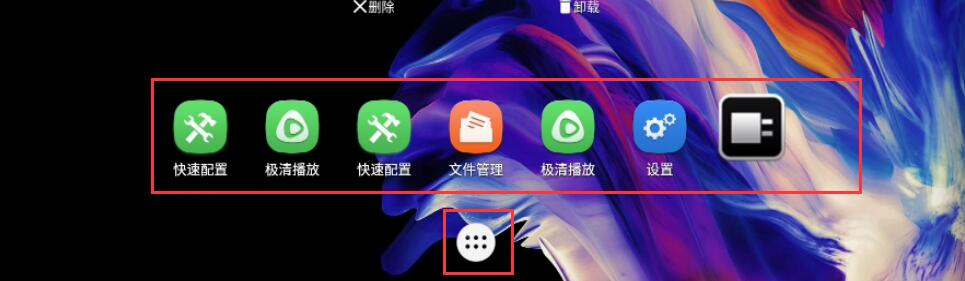
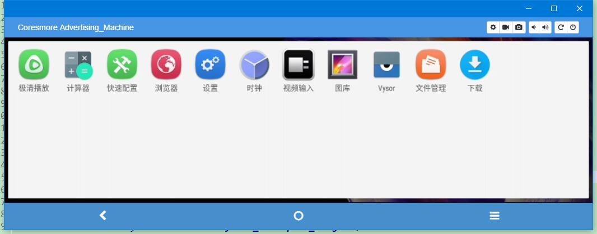
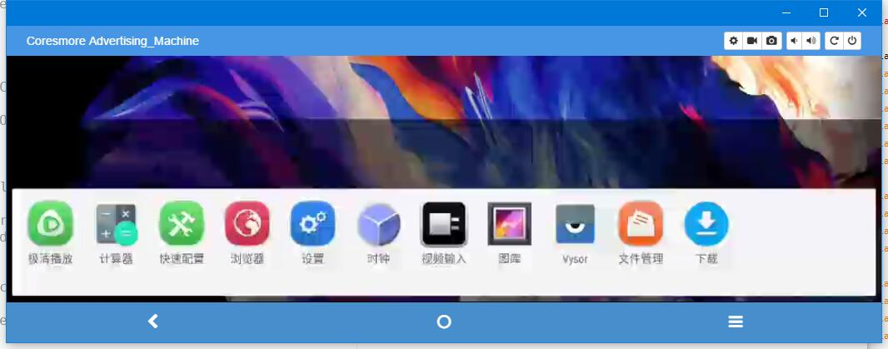

# 工作日常

#### 1. 在系统应用Launch中，关于一些页面定制的修改。

  
  

> 修改，hotseatIcon（应用）大小，主页面边距，主页面默认图标，默认控件，应用页面数量、图标大小等。  

    com.android.launcher3.InvariantDeviceProfile
    //文件地址
    
        InvariantDeviceProfile(String n, float w, float h, int r, int c, int fr, int fc, int maapc,
            float is, float its, float hs, float his, int dlId) {
        // Ensure that we have an odd number of hotseat items (since we need to place all apps)
        if (hs % 2 == 0) {
            throw new RuntimeException("All Device Profiles must have an odd number of hotseat spaces");
        }
    
        name = n;//参数配置名
        minWidthDps = w;
        minHeightDps = h;//影响主页和应用页图标(icon)大小，有可能是图标之间的间距，没具体测试过
        numRows = r; //主页可用行数，1就是只能一行。图一这样
        numColumns = c;//主页可用列数，一行可显示的图标
        numFolderRows = fr;
        numFolderColumns = fc;//文件夹可显示的行列数，将两个图标拖到一起就会合并成一个文件夹。
        minAllAppsPredictionColumns = maapc;//所有应用程序中预测的最小应用程序数量。(实际上我不知道用来干嘛的)
        iconSize = is;
        iconTextSize = its;//影响主页和应用页图标大小和字体大小
        numHotseatIcons = hs;//收藏栏可用数量，就是在主页固定的icon，显示在应用icon两边。
        hotseatIconSize = his;//应用图标大小。
        defaultLayoutId = dlId;//默认主页显示图标，在xml中定义，具体见下
    
        if(Build.ID.startsWith("ADP002A_KANGHAI")){
            hotseatIconSize = 60;
            numHotseatIcons = 1;
            numRows = 1;
            numColumns = 9;
            numFolderRows = 1;
            numFolderColumns = 2;
            defaultLayoutId = R.xml.default_workspace_kanghai;
        }
    }


​    

这些参数本来应该在`如下`中修改的，但是因为我不知道具体会引用哪一个，所以我统一修改了。

    ArrayList<InvariantDeviceProfile> getPredefinedDeviceProfiles() {
        ArrayList<InvariantDeviceProfile> predefinedDeviceProfiles = new ArrayList<>();
        // width, height, #rows, #columns, #folder rows, #folder columns,
        // iconSize, iconTextSize, #hotseat, #hotseatIconSize, defaultLayoutId.
        predefinedDeviceProfiles.add(new InvariantDeviceProfile("Super Short Stubby",
                255, 300,     2, 3, 2, 3, 3, 48, 13, 3, 48, R.xml.default_workspace_4x4));
        predefinedDeviceProfiles.add(new InvariantDeviceProfile("Shorter Stubby",
                255, 400,     3, 3, 3, 3, 3, 48, 13, 3, 48, R.xml.default_workspace_4x4));
        predefinedDeviceProfiles.add(new InvariantDeviceProfile("Short Stubby",
                275, 420,     3, 4, 3, 4, 4, 48, 13, 5, 48, R.xml.default_workspace_4x4));
        predefinedDeviceProfiles.add(new InvariantDeviceProfile("Stubby",
                255, 450,     3, 4, 3, 4, 4, 48, 13, 5, 48, R.xml.default_workspace_4x4));
        predefinedDeviceProfiles.add(new InvariantDeviceProfile("Nexus S",
                296, 491.33f, 4, 4, 4, 4, 4, 48, 13, 5, 48, R.xml.default_workspace_4x4));
        predefinedDeviceProfiles.add(new InvariantDeviceProfile("Nexus 4",
                335, 567,     4, 4, 4, 4, 4, DEFAULT_ICON_SIZE_DP, 13, 5, 56, R.xml.default_workspace_4x4));
        predefinedDeviceProfiles.add(new InvariantDeviceProfile("Nexus 5",
                359, 567,     4, 4, 4, 4, 4, DEFAULT_ICON_SIZE_DP, 13, 5, 56, R.xml.default_workspace_4x4));
        predefinedDeviceProfiles.add(new InvariantDeviceProfile("Large Phone",
                406, 694,     5, 5, 4, 4, 4, 64, 14.4f,  5, 56, R.xml.default_workspace_5x5));
        // The tablet profile is odd in that the landscape orientation
        // also includes the nav bar on the side
        int forceLand = Integer.valueOf(SystemPropertiesUtil.getString("mstar.forcelandscape", "0"));
        Log.e("", "forceLand=" + forceLand + ",orientation=" + orientation);
        if (orientation == Configuration.ORIENTATION_PORTRAIT || forceLand == 2) {
            predefinedDeviceProfiles.add(new InvariantDeviceProfile("Nexus 7",
                    575, 904,     5, 6, 4, 5, 4, 66, 18,  7, 66, R.xml.default_workspace_5x6_p));
        }else{
            predefinedDeviceProfiles.add(new InvariantDeviceProfile("Nexus 7",
                    575, 904,     1, 6, 4, 5, 4, 66, 20,  7, 66, R.xml.default_workspace_5x6));
        }
        // Larger tablet profiles always have system bars on the top & bottom
        predefinedDeviceProfiles.add(new InvariantDeviceProfile("Nexus 10",
                727, 1207,    5, 6, 4, 5, 4, 76, 14.4f,  7, 64, R.xml.default_workspace_5x6));
        predefinedDeviceProfiles.add(new InvariantDeviceProfile("20-inch Tablet",
                1527, 2527,   7, 7, 6, 6, 4, 100, 20,  7, 72, R.xml.default_workspace_4x4));
        return predefinedDeviceProfiles;
    }


默认主页设置样例。

     <favorites xmlns:launcher="http://schemas.android.com/apk/res-auto/com.android.launcher3">
        <!-- Far-left screen [0] -->
    
        <!-- Left screen [1] -->
        <appwidget
            launcher:packageName="com.android.settings"
            launcher:className="com.android.settings.widget.SettingsAppWidgetProvider"
            launcher:screen="1"
            launcher:x="0"
            launcher:y="3"
            launcher:spanX="4"
            launcher:spanY="1" />
    
        <!-- Middle screen [2] -->
        <appwidget
            launcher:packageName="com.android.deskclock"
            launcher:className="com.android.alarmclock.AnalogAppWidgetProvider"
            launcher:screen="2"
            launcher:x="1"
            launcher:y="0"
            launcher:spanX="2"
            launcher:spanY="2" />
        <favorite
            launcher:packageName="com.android.camera"
            launcher:className="com.android.camera.Camera"
            launcher:screen="2"
            launcher:x="0"
            launcher:y="3" />
    
        <!-- Right screen [3] -->
        <favorite
            launcher:packageName="com.android.gallery3d"
            launcher:className="com.android.gallery3d.app.Gallery"
            launcher:screen="3"
            launcher:x="1"
            launcher:y="3" />
        <favorite
            launcher:packageName="com.android.settings"
            launcher:className="com.android.settings.Settings"
            launcher:screen="3"
            launcher:x="2"
            launcher:y="3" />
    
        <!-- Far-right screen [4] -->
    
        <!-- Hotseat (We use the screen as the position of the item in the hotseat) -->
        <!-- Dialer, Contacts, [All Apps], Messaging, Browser -->
        <resolve
            launcher:container="-101"
            launcher:screen="0"
            launcher:x="0"
            launcher:y="0" >
            <favorite launcher:uri="#Intent;action=android.intent.action.DIAL;end" />
            <favorite launcher:uri="tel:123" />
            <favorite launcher:uri="#Intent;action=android.intent.action.CALL_BUTTON;end" />
    
            <favorite
                launcher:packageName="com.android.dialer"
                launcher:className="com.android.dialer.DialtactsActivity" />
        </resolve>
    
        <favorite
            launcher:packageName="com.android.contacts"
            launcher:className="com.android.contacts.activities.PeopleActivity"
            launcher:container="-101"
            launcher:screen="1"
            launcher:x="1"
            launcher:y="0" />
    
        <resolve
            launcher:container="-101"
            launcher:screen="3"
            launcher:x="3"
            launcher:y="0" >
            <favorite
                launcher:uri="#Intent;action=android.intent.action.MAIN;category=android.intent.category.APP_MESSAGING;end" />
            <favorite launcher:uri="sms:" />
            <favorite launcher:uri="smsto:" />
            <favorite launcher:uri="mms:" />
            <favorite launcher:uri="mmsto:" />
    
            <favorite
                launcher:packageName="com.android.mms"
                launcher:className="com.android.mms.ui.ConversationList" />
        </resolve>
        <resolve
            launcher:container="-101"
            launcher:screen="4"
            launcher:x="4"
            launcher:y="0" >
            <favorite
                launcher:uri="#Intent;action=android.intent.action.MAIN;category=android.intent.category.APP_BROWSER;end" />
            <favorite launcher:uri="http://www.example.com/" />
    
            <favorite
                launcher:packageName="com.android.browser"
                launcher:className="com.android.browser.BrowserActivity" />
        </resolve>
    
    </favorites>

---

设置工作区间大小。

     com.android.launcher3.DeviceProfile
    
        /** Returns the search bar bounds in the current orientation */
    public Rect getSearchBarBounds(boolean isLayoutRtl) {
        Rect bounds = new Rect();
        if (isLandscape && transposeLayoutWithOrientation) {
            if (isLayoutRtl) {
                bounds.set(availableWidthPx - searchBarSpaceHeightPx, edgeMarginPx,
                        availableWidthPx, availableHeightPx - edgeMarginPx);
            } else {
                bounds.set(0, edgeMarginPx, searchBarSpaceHeightPx,
                        availableHeightPx - edgeMarginPx);
            }
        } else {
            if (isTablet) {
                // Pad the left and right of the workspace to ensure consistent spacing
                // between all icons
                int width = getCurrentWidth();
                // XXX: If the icon size changes across orientations, we will have to take
                //      that into account here too.
                int gap = (int) ((width - 2 * edgeMarginPx -
                        (inv.numColumns * cellWidthPx)) / (2 * (inv.numColumns + 1)));
                bounds.set(edgeMarginPx + gap, getSearchBarTopOffset(),
                        availableWidthPx - (edgeMarginPx + gap),
                        searchBarSpaceHeightPx);
            } else {
                bounds.set(desiredWorkspaceLeftRightMarginPx - defaultWidgetPadding.left,
                        getSearchBarTopOffset(),
                        availableWidthPx - (desiredWorkspaceLeftRightMarginPx -
                        defaultWidgetPadding.right), searchBarSpaceHeightPx);
            }
        }
        return bounds;//返回的这个区间就是大小了，上左右下，具体演算我没去看，直接自己设置固定值。
    }

---

#### 2. 设置了OVERSCAN top参数之后，工作、应用空间出现多余的间隔。

  

出现这种问题，我怀疑应该是一个BUG，设置了值之后就会出现多一倍的空余空间出来。

解决办法，找了好几天之后终于还是被我找到了，在`Workspace.java`里面有一个矩形空间`mInsets`，发现里面的值刚刚就是overscan的值，尝试改了一下发现果然有效，但是并不全面然后全局搜索了一下。发现还有三个位置，先后调用顺序分别为：

    com.android.launcher3.InsettableFrameLayout//最先调用
    com.android.launcher3.Workspace//第二
    com.android.launcher3.BaseContainerView//第三


在这三个类里面都有着类似的这个方法，后面测试发现只要改第一个里面的值后面也会相应影响，第一个（InsettableFrameLayout）在哪调用的就不得而知了。

        @Override
    public void setInsets(Rect insets) {
    //        Log.d("TTTTTTTTTTTT", "3333333"+insets.top);
    //        insets.top = 0;
        final int n = getChildCount();
        for (int i = 0; i < n; i++) {
            final View child = getChildAt(i);
            setFrameLayoutChildInsets(child, insets, mInsets);
        }
        mInsets.set(insets);
    }

#### 3. 设置网口静态IP地址。

> 我们机器上面`ifconfig`里面有多个地址、eth0也就是本方法可改变的值，机器网口、wlan0 wifi地址、p2p0 应该是流量吧、lo 未知。

[参考地址1](https://blog.csdn.net/u011561668/article/details/75332655)|[参考地址2](https://www.jianshu.com/p/e1191c41d70a)  

需要添加权限：测试版本6.0

```xml
<uses-permission android:name="android.permission.ACCESS_WIFI_STATE" />
<uses-permission android:name="android.permission.ACCESS_NETWORK_STATE" />
<uses-permission android:name="android.permission.WRITE_SETTINGS" />
<uses-permission android:name="android.permission.CONNECTIVITY_INTERNAL" />
```

具体方法：  
(1)声明变量：

```java
EthernetManager mEthManager;
private  static String mEthIpAddress = "192.168.253.247";  //IP
private  static String mEthNetmask = "255.255.255.0";  //  子网掩码
private  static String mEthGateway = "192.168.88.1";   //网关
private  static String mEthdns1 = "8.8.8.8";   // DNS1
private  static String mEthdns2 = "8.8.4.4";   // DNS2
```

(2)在需要改变信息的地方加上如下代码：

```java
mEthManager = (EthernetManager)getSystemService("ethernet");
InetAddress ipaddr=NetworkUtils.numericToInetAddress(mEthIpAddress);
DhcpInfo dhcpInfo = new DhcpInfo();
dhcpInfo.ipAddress = inetAddressToInt(ipaddr);
Inet4Address inetAddr= Utils.getIPv4Address(mEthIpAddress);
int prefixLength=Utils.maskStr2InetMask(mEthNetmask);
InetAddress gatewayAddr = Utils.getIPv4Address(mEthGateway);
InetAddress dnsAddr = Utils.getIPv4Address(mEthdns1);
if (inetAddr.getAddress().toString().isEmpty() || prefixLength ==0 || gatewayAddr.toString().isEmpty()|| dnsAddr.toString().isEmpty()) {
	return;
}
Class<?> clazz = null;
try {
	clazz = Class.forName("android.net.LinkAddress");
} catch (Exception e) {

}
Class[] cl = new Class[]{InetAddress.class, int.class};
Constructor cons = null;
try {
	 cons = clazz.getConstructor(cl);
} catch (NoSuchMethodException e) {
	e.printStackTrace();
}
Object[] x = {inetAddr, prefixLength};
StaticIpConfiguration mStaticIpConfiguration = new StaticIpConfiguration();
String dnsStr2 = mEthdns2;
//mStaticIpConfiguration.ipAddress = new LinkAddress(inetAddr, prefixLength);
try {
	mStaticIpConfiguration.ipAddress = (LinkAddress) cons.newInstance(x);
	Log.d("232323", "chanson 1111111");
} catch (InstantiationException e) {
 e.printStackTrace();
} catch (IllegalAccessException e) {
e.printStackTrace();
} catch (InvocationTargetException e) {
e.printStackTrace();
}
mStaticIpConfiguration.gateway=gatewayAddr;
mStaticIpConfiguration.dnsServers.add(dnsAddr);
if (!dnsStr2.isEmpty()) {
	mStaticIpConfiguration.dnsServers.add(Utils.getIPv4Address(dnsStr2));
}
Log.d("2312321", "chanson mStaticIpConfiguration  ====" + mStaticIpConfiguration);

IpConfiguration  mIpConfiguration = new IpConfiguration(IpConfiguration.IpAssignment.STATIC,
IpConfiguration.ProxySettings.NONE, mStaticIpConfiguration, null);
mEthManager.setConfiguration(mIpConfiguration);
```

Utils类相关方法：


    public static Inet4Address getIPv4Address(String text) {
    try {
    	return (Inet4Address) NetworkUtils.numericToInetAddress(text);
    } catch (IllegalArgumentException|ClassCastException e) {
        return null;
    }
    }
    public static int maskStr2InetMask(String maskStr) {
    	StringBuffer sb ;
    	String str;
    	int inetmask = 0;
    	int count = 0;
    /*
    * check the subMask format
    */
    Pattern pattern = Pattern.compile("(^((\\d|[01]?\\d\\d|2[0-4]\\d|25[0-5])\\.){3}(\\d|[01]?\\d\\d|2[0-4]\\d|25[0-5])$)|^(\\d|[1-2]\\d|3[0-2])$");
    if (pattern.matcher(maskStr).matches() == false) {
      Log.e("33333","subMask is error");
    return 0;
    }
    String[] ipSegment = maskStr.split("\\.");
     for(int n =0; n<ipSegment.length;n++) {
     sb = new StringBuffer(Integer.toBinaryString(Integer.parseInt(ipSegment[n])));
    str = sb.reverse().toString();
    count=0;
    for(int i=0; i<str.length();i++) {
        i=str.indexOf("1",i);
    	if(i==-1)
    	break;
    	count++;
    	}
    inetmask+=count;
     }
    return inetmask;
    }


#### 4. Android 6.0 默认桌面壁纸修改

frameworks/base/core/java/android/app/WallpaperManager.java

frameworks/base/core/res/res/下 
drawable-sw720dp-nodpi/default_wallpaper.jpg 
drawable-nodpi/default_wallpaper.jpg 
drawable-sw600dp-nodpi/default_wallpaper.jpg

参考：https://blog.csdn.net/qq_27256793/article/details/80976871


#### 5. Android4.0 时间更新分析 NTPServer更改

frameworks\base\core\java\android\util\NtpTrustedTime.java

frameworks/base/core/res/res/values/config.xml

参考：https://blog.csdn.net/nickzhang2010/article/details/8004560

#### 6. Android 9.0修改设备名称（amlogic）
```
路径在
/device/amlogic/marconi/marconi.mk

修改：
PRODUCT_NAME := marconi
PRODUCT_DEVICE := marconi
PRODUCT_BRAND := Coresmore
PRODUCT_MODEL := Car Entertainment
PRODUCT_MANUFACTURER := ShenZhen Coresmore Technology Co.,LTD
```
参考：
https://blog.csdn.net/yql44137228/article/details/41862167
http://blog.sina.com.cn/s/blog_4b4b54da0102wcjz.html

