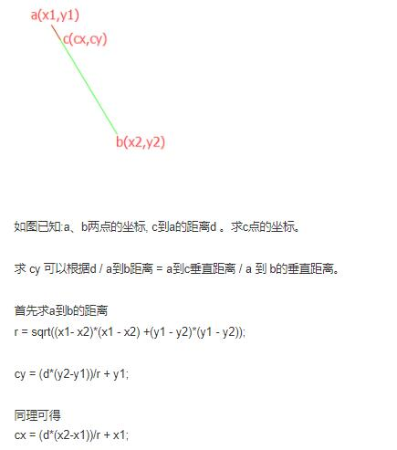

# 自定义View日常

## [自定义View学习](https://github.com/GcsSloop/AndroidNote)

#### 1. Android 自定义View的时候当继承类是ViewGroup的时候onDraw方法不生效。
> 分析参考：[自定义viewGroup 为什么不走 onDraw方法？](https://blog.csdn.net/sinat_26710701/article/details/71171726)  

如果你想要在自定义viewgroup中重写onDraw方法，必须在构造函数中调用  
`setWillNotDraw(false);`

---

#### 2. Android 已知坐标轴两点，求两点之间距离。
> 这其实是一道数学题。自定义View大部分都这样。欸，可惜我都忘了

```java
	/**传入两点，返回长度*/
    public double GetDistance(Point point1, Point point2) {
        double distance;
        distance = Math.pow((point1.x - point2.x), 2) + Math.pow((point1.y - point2.y), 2);
        distance = Math.sqrt(distance);
        return distance;
    }
```

---
#### 3. Android 已知两点，求两点之中的某一段距离的点。
> [参考资料](https://blog.csdn.net/can3981132/article/details/62040993)  

