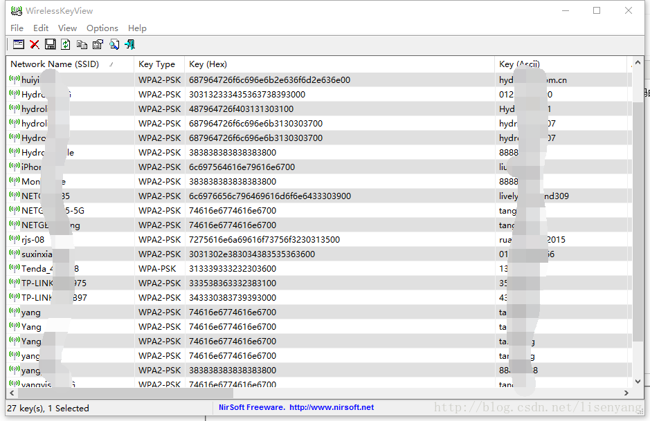
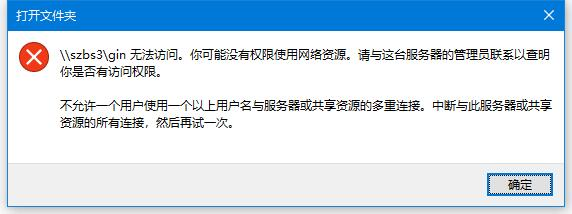
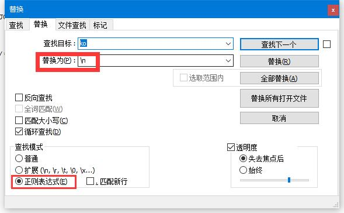

## 计算机使用日常

#### 1.  shadowsocks代理，软件中使用代理。

> 名称随便写，SS默认服务器是127.0.0.1，端口1080，类型socks5  

---
#### 2. 一个好用的本地编辑器
> 上周找了半天的本地编辑器，然而大部分都是在线的，后来找到了一个Miu编辑器。不支持直接打开和保存，凑合用了一周发现了BUG，保存`\`等字符串会出现奇怪的标签。
> [Miu下载地址](https://github.com/516457377/Note/raw/master/Windowns/%E8%AE%A1%E7%AE%97%E6%9C%BA%E6%97%A5%E5%B8%B8/Miu-Ange-0.1.3-Setup.exe)  
> 后来又继续寻找找到了现在这款软件，目前觉得还行，使用中。支持直接打开、保存，可视化等。（对了还有有道笔记。但是也需要联网。）  
> [typora官网地址](https://typora.io/#)|[本地下载地址](https://github.com/516457377/Note/raw/master/Windowns/%E8%AE%A1%E7%AE%97%E6%9C%BA%E6%97%A5%E5%B8%B8/typora-setup-x64.exe)  
---
####  3. [Win10局域网共享](https://github.com/516457377/Note/blob/master/Windowns/计算机日常/Win10%E5%85%B1%E4%BA%AB.png)

> ※ 还有再网络共享中心，打开共享关闭密码验证别搞漏了。  
> 因为懒得搬运直接截图了。图大就不搬出来了，点进去看吧。  
> [原文地址](https://blog.csdn.net/qq_29558839/article/details/80711013)

---
#### 4. 分享一个计算机查看连接过的wifi密码软件
> 以前win7的时候可以在网络共享中心很方便的查看，但是win10的时候就不太方便了。  
> [已连接wifi秘密查看器：下载地址](https://raw.githubusercontent.com/516457377/Note/master/Windowns/%E8%AE%A1%E7%AE%97%E6%9C%BA%E6%97%A5%E5%B8%B8/%E5%B7%B2%E8%BF%9E%E6%8E%A5wifi%E7%A7%98%E5%AF%86%E6%9F%A5%E7%9C%8B%E5%99%A8.rar)  
> 

---
#### 5. 短网址生成。
> 有时候为了分享一个网址但是链接又很长的时候就可以使用短网址，短网址生成百度有一大把，原理其实很简单，找一个便宜的域名然后/自己做个解析地址，直接在域名里面跳转到自己的网址中，当然我现在还不会。
> 分享几个短网址生成的地址：[新浪短网址生成](http://dwz.wailian.work/)|[百度](https://dwz.cn/)
> 个人比较喜欢新浪的，不需要审核，并且挺靠谱的。另外百度搜一下生成一大把。

---
#### 6. win7锁定任务栏图标快捷方式地址
> 从笔记一搬运

`C:\Users\Liaohuan\AppData\Roaming\Microsoft\Internet Explorer\Quick Launch\User Pinned\TaskBar`

---
#### 7.PhotoShow 快捷键切换显示模式（全屏/隐藏工具栏等）
> 今天使用PS的时候无意间不小心摸到了某个键导致周围的工具栏都消失了。

查询资料得知：切换快捷键为`TAB`或者`F`。两个分别是不同的显示模式。

---
#### 8. 当登录了远程计算机后不能登录第二台的时候
参考：[https://blog.csdn.net/liuhaomatou/article/details/39395209](https://blog.csdn.net/liuhaomatou/article/details/39395209)  

  
如图原因：
解决方法：

打开cmd命令窗口：
1.输入命令：net use查看你当前与网络资源的连接，例如驱动器映射、IPC连接。

2.用net use * /del /y命令中断开所有连接.

3.在重新登录就可以连接上了

---
#### 9. 关于GitHub Desktop设置代理的方法
在软件里面找了半天没能找到设置代理的地方。。
https://blog.csdn.net/fhqfghgdx1993/article/details/80205585
找到文件`C:\Users\xxxxx\.gitconfig`在后面添加如下代理地址（自行修改。）

```
[http]
    proxy = http://127.0.0.1:1080
```

---
#### 10. 全角和半角的使用

1、在中文输入法中，切换全角和半角格式的快捷键为SHIFT+空格。

2、一般的系统命令是不用全角字符的，只是在作文字处理的时候才会使用全角字符。

3、在编程序的源代码中只能使用半角标点，但是字符串内部的数据可以使用全角字符或者全角标点。
4、在不支持汉字等语言的计算机上只能使用半角标点。其实，在这种情况下根本就不存在全角半角的概念了。

5、在汉字输入法中，输入的字母数字默认为半角，但是标点则是默认为全角。

6、在进行中文处理时，汉字和标点符号使用全角，字母、其它符号和数字使用半角。即王码五笔字型中的默认输入状态就是。

在进行英文处理时，如：英文输入、编写程序、电子邮件地址、网站URL等。全部使用半角进行处理。

参考资料：[百度百科-全角](https://baike.baidu.com/item/%E5%85%A8%E8%A7%92)

---
#### 11. linux常用命令：创建文件和文件夹

> 简述：创建文件：touch 　　创建文件夹：mkdir

1.首先说一下touch 创建文件的命令，touch可以用于创建二进制文件，用法非常简单。用法：touch+文件名，touch与文件名之间一定要有空格。图中先用之前分享过的命令来查看一下/目录下面有多少文件以及文件的名字。

2.在说一个命令mkdir 创建文件夹，mkdir可以创建文件夹，用法非常简单，用法：mkdir+文件夹名字，mkdir与文件名之间一定要有空格。图中先用之前分享过的命令来查看一下/目录下面有多少文件以及文件的名字

---


#### 12. linux的svn之checkout命令
**常用检出命令：**
svn checkout http://路径(目录或文件的全路径)　[本地目录全路径] --username　用户名
svn checkout svn://路径(目录或文件的全路径)　[本地目录全路径]  --username　用户名

注：可以不带用户名和密码，检出后会要求输入。

eg:

svn co svn://192.168.0.3/测试工具 /home/testtools --username luke

svn co http://192.168.0.3/test/testapp --username luke

svn checkout svn://192.168.0.3/测试工具 /home/testtools --username luke

svn checkout http://192.168.0.3/test/testapp --username luke


**检出指定具体版本：**

svn co http://路径(目录或文件的全路径)　[本地目录全路径] [--revision] --username 用户名 --password 密码

svn checkout svn://路径(目录或文件的全路径)　[本地目录全路径] [--revision] --username　用户名

svn co [--revision] http://路径(目录或文件的全路径)　[本地目录全路径] --username 用户名 --password 密码

svn checkout [--revision] svn://路径(目录或文件的全路径)　[本地目录全路径] --username　用户名

eg:

svn checkout http://siphon.googlecode.com/svn/trunk/ siphon -r r791
svn checkout -r r791 http://siphon.googlecode.com/svn/trunk/ siphon 


**检出不包括源文件夹根目录：**

比如我要checkout   trunk/ 下面的所有文件，但是不包括trunk 文件夹

我们可以在svn文件夹后面打个空格，在加个“.”就行了

svn co http://192.168.1.10/svn/project/trunk/ /home/DSP-OPEN

改为:
svn co http://192.168.1.10/svn/project/trunk/ . /home/DSP-OPEN

 ———————————————— 
版权声明：本文为CSDN博主「NeverGiveUp7」的原创文章，遵循CC 4.0 by-sa版权协议，转载请附上原文出处链接及本声明。
原文链接：https://blog.csdn.net/gengxiaoming7/article/details/50512195

---
#### 13. 文件查找替换的时候需要替换成换行如何操作？
选择一款文本工具，打开替换窗口，把XX替换成<换行符>即可。
不同的工具换行符的表示不尽相同：
Word的换行符是^p
UltraEdit 的换行符是^n
Replace Pioneer 和 Editplus, Notepad++ 的换行符是\n(Notepad++需要打开正则表达式选项)



---

#### 14. SVN还原项目到某一版本

https://blog.csdn.net/u013131533/article/details/48160759

---
#### 15. 一款重复文件查找软件。推荐
下载地址。

[Wise Duplicate Finder 下载地址](https://raw.githubusercontent.com/516457377/Note/master/Windowns/%E8%AE%A1%E7%AE%97%E6%9C%BA%E6%97%A5%E5%B8%B8/Wise%20Duplicate%20Finder%E3%80%90%E9%87%8D%E5%A4%8D%E6%96%87%E4%BB%B6%E6%9F%A5%E6%89%BE%E3%80%91.7z)  